## 零、前言

本專案合作對象為「睿程生醫」，是一間技術導向的醫材新創公司。公司核心技術能力很強，創辦背景來自骨科臨床需求，父親本身是骨科醫師，能直接從手術與復健現場發現問題，並自行研發對應產品。睿程生醫目前正在發展 3D modeling、手術輔助器材、拓樸優化、生化材料與客製化骨釘等技術。

然而，公司目前的問題不在於技術本身，而在於管理、溝通、行銷與商業化能力跟不上技術成熟度。公司實際在辦公室的人不到五人，內部溝通主要依賴 LINE，研發紀錄與設計修改歷程沒有被完整結構化保存；同時也沒有專責業務人員或完整網站，導致公司難以向投資人、醫師、醫院與病患有效傳遞產品價值。

因此，本專案的核心目標不是建立一套龐大的企業系統，而是以最低 IT 成本建置一套輕量級資訊系統，協助公司解決兩個最迫切的問題：

1. 研發協作與醫材檔案溝通混亂。
2. 缺乏業務與對外資訊傳遞管道。

本系統以「雲端協作、公開產品型錄、輕量資料庫」為核心，把錢花在刀口上，讓小型醫材新創不必承擔傳統 ERP 的高成本與高維護負擔，也能讓拓樸優化與客製化醫材技術更容易被理解、追蹤與商業化。

## 一、合作公司與現況

### 1. 公司成立原因

睿程生醫成立的主要原因，是希望解決醫生、醫院與醫材設計之間的法規、溝通與產品開發問題。醫療輔助器材與客製化醫材常需要醫師、設計端、廠商與病患之間來回確認，但目前流程多仰賴人工溝通，容易產生延遲與紀錄不足。

### 2. 目前主要業務與技術方向

公司目前的工作內容包含：

- 3D modeling 設計醫療輔助器材。
- 製作模型給病人理解手術或復健狀況。
- 製作模型給廠商理解產品結構與製造需求。
- 研發手術中、手術後使用的輔助固定器。
- 探索病人購買個人化模型的可能性，例如紀念、理解病況或復健用途。
- 發展拓樸優化與生化材料客製化骨釘。

拓樸優化是公司未來的重點方向。透過 AI 算力提升，設計端可以設定材料、受力點與目標條件，讓電腦自動產生更有效率的結構模型。這項技術具有客製化、高技術門檻與醫療應用潛力，但也需要更完整的資料管理、材料參數紀錄、版本追蹤與對外展示方式。

### 3. 組織規模與資訊工具

公司人數約十幾人，但實際在辦公室的人不到五人。團隊對資訊工具接受度高，目前內部主要使用 LINE 溝通，但較少有正式紀錄。目前也沒有人員專門負責銷售、業務開發或投資人簡報。

這代表公司不適合導入大型 ERP，但非常適合導入一套輕量、可快速上手、只針對關鍵流程設計的資訊系統。本專案目前實作重點放在內部醫材協作平台、公開產品型錄、外部需求申請與專案成本/BOM 管理；更完整的 Apple 式官網、AI FAQ bot 與投資人專區可列為未來擴充，而不是本次 demo 的主體。

## 二、訪談紀錄整理

### 1. 訪談前觀察

原 proposal 的問題是缺乏特殊性，也缺乏對合作公司的深入理解。經過訪談後，本組發現公司真正的痛點不是單純「需要網站」或「需要資料庫」，而是：

- 技術很強，但缺乏能把技術轉換成商業價值的資訊介面。
- 醫材設計涉及材料、版本、醫師回饋與法規稽核，但目前紀錄不夠完整。
- 公司規模小，不適合高成本、複雜度高的管理系統。

### 2. 公司營運流程

公司目前會依照醫療或產品需求進行 3D modeling，設計出的模型主要提供給兩類對象：

1. 病人：讓病人理解手術、術後狀況或復健模型。
2. 廠商：讓製造端理解產品結構與製作需求。

例如手術線拉線很細、不好操作，公司會思考是否能在器材上增加金屬環，讓產品更人性化。部分設計圖涉及專利，不能完整公開，但可以使用相似或展示用模型呈現技術能力。

目前公司正在做 tadcad、拓樸優化、生化材料與客製化骨釘。客製化骨釘發展潛力大，但制約也多，包含法規、材料、製程與醫療責任，因此更需要完整的版本與材料紀錄。

### 3. 對外網站需求

訪談中提到，網站造訪者主要有三類：

- 投資人。
- 骨科醫師與醫院。
- 病人。

公司希望網站給人的感受是「創新、有效率、專業」。內容應包含產品、技術、優化參數、材料規格與醫療執照。分類方式可依照術前、術中、術後，或依照身體部位進行整理。

呈現方式上，公司偏好類似 Apple 官網的風格：清楚展示產品、規格、對照與互動效果，不需要過度花俏。網站可透過旋轉產品、結構放大、功能解釋與術前術後對照，讓抽象的拓樸優化技術變得容易理解。

訪談時也提到可加入線上洽談、問答 bot、常見問題與 AI 功能。不過目前公司尚未建立完整 FAQ，因此初期可先建立基礎問答與留單機制，後續再逐步擴充。

### 4. 成本與利潤現況

目前成本來源分散，包含：

- 居家 3D 印表機。
- 3D 列印耗材。
- 醫療不鏽鋼等外部打樣費用。
- 辦公室租金，約每月 15,000 至 20,000 元。

公司未來可能考慮技術授權、賣給其他團隊或進行更大規模的商業合作。如果沒有單一專案的真實成本、毛利與定價資料，將很難向投資人或收購方證明技術的商業價值。

## 三、訪談逐字稿整理版

### 1. 訪談開場與公司背景

**小組員：** 我們想先了解一下公司成立的原因。當初為什麼會開始做這個醫材相關的公司？

**睿程負責人：** 一開始主要是想解決醫生、醫院跟醫材設計之間的一些法規和溝通問題。因為醫療器材不是一般產品，很多東西不能只是做出來，還要能說明它為什麼這樣設計、怎麼使用、跟臨床需求有什麼關係。

**小組員：** 所以公司比較偏技術研發導向？

**睿程負責人：** 對，技術是比較核心的部分。像我們會做 3D modeling，設計一些手術輔助器材，也會做模型給病人看，或是給廠商看。現在也有在看拓樸優化、生化材料跟客製化骨釘這類方向。

**小組員：** 拓樸優化可以簡單說明一下嗎？

**睿程負責人：** 它比較像是一種設計概念。以前設計結構可能要靠工程師反覆調整，但現在 AI 算力提升後，可以設定目的、受力點或限制條件，讓電腦去跑出比較有效率的模型。這件事應用到客製化醫材會很有潛力。

**小組員：** 公司目前大概有多少人？

**睿程負責人：** 全部加起來大概十幾個，但真的會在辦公室的人不到五個。

### 2. 現行作業與內部溝通

**小組員：** 平常公司內部怎麼溝通？例如設計圖、模型或修改意見。

**睿程負責人：** 目前主要還是用 LINE。大家比較習慣，用起來也快。

**小組員：** 那會有版本混亂的問題嗎？

**睿程負責人：** 目前還沒有到很嚴重，因為人不多，大家大概知道現在用的是哪一版。不過如果之後案子變多，或要跟更多醫生、廠商合作，可能就會比較麻煩。

**小組員：** 目前修改紀錄會特別保存嗎？

**睿程負責人：** 沒有很完整。比較多是靠 LINE 訊息、口頭討論，或是檔案名稱自己註記。正式的紀錄沒有做得很完整。

**小組員：** 如果未來遇到醫療法規稽核，會需要知道每一版是為什麼修改的嗎？

**睿程負責人：** 這會需要。醫材跟一般產品不一樣，如果要證明設計過程或材料選擇，就不能只拿最後一版檔案，最好要知道前面怎麼改、為什麼改、誰確認過。

### 3. 產品、技術與未來方向

**小組員：** 現在公司主要做哪些產品或應用？

**睿程負責人：** 目前會做 3D 模型，讓病人看，也讓廠商看。有些是手術輔助器材，有些是術後或復健相關的模型。像手術線很細不好拉，我們可能會設計一個金屬環，讓使用上更人性化。

**小組員：** 有些設計可以公開展示嗎？

**睿程負責人：** 有些不行，因為涉及專利。但可以做類似展示用的模型，讓外部的人理解技術方向。

**小組員：** 未來最想發展的是哪一塊？

**睿程負責人：** 拓樸骨釘是很重要的方向。客製化骨釘潛力大，但限制也多，像材料、法規、製程都要考慮。

**小組員：** 病人會想買自己的模型嗎？

**睿程負責人：** 有可能。有些人可能覺得有趣，有些人可能是復健或理解病況需要。這可以是一個方向。

### 4. 對外網站與行銷需求

**小組員：** 目前有人負責銷售或業務嗎？

**睿程負責人：** 目前沒有專門的人負責銷售。

**小組員：** 如果做網站，你們覺得主要會給誰看？

**睿程負責人：** 主要可能是投資人、骨科醫師或醫院，還有病人。

**小組員：** 這三種人看到的內容需要不一樣嗎？

**睿程負責人：** 一開始想法是可以不用差太多，整體看起來專業一點，偏重技術講解。但不同對象關心的事情確實不太一樣，投資人可能看技術和商業價值，醫師看臨床用途，病人看術前術後或復健。

**小組員：** 網站應該呈現哪些內容？

**睿程負責人：** 產品、技術、優化參數、材料規格、執照。分類可以用術前、術中、術後，或是用身體部位來分。

**小組員：** 呈現方式有偏好的風格嗎？

**睿程負責人：** Apple 那種不錯，展示、規格說明、對照都很清楚，不用太花俏。可以旋轉產品、放大結構、解釋功能，讓人知道我們可以做到哪些事。

**小組員：** 會需要線上洽談或問答功能嗎？

**睿程負責人：** 可以。有 FAQ bot 或 AI 問答應該不錯，但目前還沒有整理完整問題集。

### 5. 成本、利潤與商業化

**小組員：** 目前成本主要包含哪些？

**睿程負責人：** 有些是在家用 3D 印表機印，會有耗材成本。實際做醫療不鏽鋼打樣也會有打印費用。另外辦公室租金大概一萬五到兩萬。

**小組員：** 目前會把這些成本集中記錄嗎？

**睿程負責人：** 沒有很完整。很多成本是分散的。

**小組員：** 如果要算單一產品毛利，現在容易算嗎？

**睿程負責人：** 不容易。因為工時、耗材、外包打樣、租金攤提都要算進去，但目前沒有一個系統統整。

**小組員：** 未來會考慮技術授權、募資或賣給其他團隊嗎？

**睿程負責人：** 有可能。所以如果能有比較清楚的成本、毛利和專案資料，對未來談合作或投資會比較有幫助。

### 6. 對系統方向的確認

**小組員：** 所以我們理解下來，公司不一定需要大型 ERP，比較需要的是一套輕量系統，把模型、版本、材料、回饋、報告和成本整理起來，對外再有一個產品型錄或展示入口，這樣理解對嗎？

**睿程負責人：** 對。ERP 對我們來說太大了，現在人少，用不到那麼多功能。如果可以用比較低成本的方式，先解決溝通、紀錄、展示和成本問題，會比較實際。

**小組員：** 內部協作平台的部分，我們會讓 3D 模型集中上傳，版本綁定材料，醫師可以回饋，系統能留下修改紀錄和簽核紀錄。這樣對未來法規或專利證明也比較有幫助。

**睿程負責人：** 這個方向是有幫助的。醫療器材如果之後要更正式地往外推，紀錄跟追蹤會很重要。

**小組員：** 對外展示部分，這次系統會先做公開產品型錄和需求申請，讓外部的人至少能看到產品和留下需求。更完整的互動網站或 AI bot 可以放在未來擴充。

**睿程負責人：** 可以，先有一個入口也很好，不然現在其實沒有一個地方可以清楚介紹產品和收需求。

**小組員：** 成本資料庫的部分，我們會把材料成本、工時與外部打樣成本綁到專案，讓每一案可以整理 BOM 與成本基礎，作為後續報價與毛利估算依據。

**睿程負責人：** 這也很需要。之後如果要跟投資人或其他團隊談，不能只講技術，也要有數字。

## 四、產業完整分析

### 1. 產業背景：高齡化與精準醫療推動客製化醫材需求

醫療器材產業正在從標準化、量產型產品，逐步走向「依病患條件、手術需求與材料特性調整」的客製化醫材。骨科、口腔顎面、神經外科與復健相關領域尤其明顯，因為人體骨骼結構、缺損位置、受力條件與術後復原狀態都高度個人化。對睿程生醫而言，3D modeling、手術導板、固定器、客製化骨釘與拓樸優化正好位在這個產業趨勢上。

台灣醫材新創常見的挑戰不是沒有技術，而是難以把臨床問題、工程設計、材料成本、法規紀錄與商業溝通整合成一套可被外部理解的流程。醫師看重臨床安全與操作效率，醫院看重採購與合規，投資人看重市場規模與商業化能力，病患則需要理解產品對治療或復健的幫助。若公司只靠口頭介紹或 LINE 傳檔，很難同時滿足這些受眾。

### 2. 產業痛點：醫材開發不只是做出產品，而是證明產品可信

醫材產業與一般製造業不同，產品開發過程必須能留下設計依據。每一次模型修改都可能涉及臨床回饋、材料選擇、製造限制、測試報告或合規文件。若紀錄不完整，短期會造成交接困難，長期則會影響法規審查、專利證明、醫院合作與投資人盡職調查。

對小型醫材新創而言，導入大型 ERP 或完整 QMS 成本過高；但只使用雲端硬碟、Excel 或聊天工具又不足以處理版本、權限、稽核與 BOM。這形成一個明確的產業缺口：公司需要的是「輕量但有結構」的醫材資料管理系統，而不是傳統企業軟體的完整套裝。

### 3. 市場機會：以輕量協作系統補足新創商業化斷點

睿程生醫目前的機會在於把技術能力轉換成可展示、可追蹤、可報價的商業資產。若系統能讓外部訪客理解產品套組，讓內部同仁追蹤 STL 版本與材料成本，讓醫師回饋被保存，讓管理者看到外部申請與 BOM，這套平台就不只是資料庫，而是公司的營運基礎建設。

此類系統也能支援未來多種商業模式：

- 專案型客製化醫材設計服務。
- 手術導板、固定板、模型與套組產品銷售。
- 3D modeling 與拓樸優化技術授權。
- 醫院、診所、製造廠商之間的協作平台。
- 投資人或合作方盡職調查用的研發與成本資料庫。

### 4. AI 導入機會：不是為了炫技，而是降低理解與交接成本

醫材資料本身複雜，包含專案、版本、材料、報告、成本、回饋、簽核與外部申請。對新同仁或外部合作方來說，最大的困難是「不知道先看哪裡」。因此 AI 最適合先用在導覽、摘要與提醒，而不是直接取代醫療判斷。

本系統可將 AI 定位為交接助理與營運助理：

- 依角色產生操作導覽，讓管理員、工程師、醫師、廠商與業務窗口快速上手。
- 摘要今日待處理專案、缺少文件與待簽核版本。
- 將醫師回饋轉成工程待辦，降低溝通落差。
- 將外部申請整理成商機清單，協助沒有專職業務的小公司追蹤客戶。
- 對投資人或醫師生成產品與技術摘要，降低對外說明成本。

因此，AI 元素不只是報告上的加分，而是符合公司實際需求：公司人少、交接成本高、業務能量不足，AI 可以補上「整理資訊、引導操作、降低說明成本」這三個缺口，也能成為公司願意投入預算的合理金流項目。

### 5. 競爭與定位：小型醫材新創的低成本數位化入口

傳統 ERP、PLM 或 QMS 系統適合大型企業，但對睿程生醫這種小型技術新創而言，成本、導入時間與維護負擔都太高。相反地，本專案的定位是「醫材研發協作與產品商業化的最小可行平台」：先抓住最重要的 STL 版本、材料、回饋、報告、BOM、申請與稽核資料，再用 AI 導覽降低上手門檻。

這個定位能避開大型系統的沉重，也比 LINE、雲端硬碟或 Excel 更有資料結構。對公司來說，它是一個能被展示、能被交接、能支援未來募資與商業合作的資訊系統雛形。

## 五、具體痛點分析

### 痛點一：用 LINE 溝通早晚出事，存在合規風險

醫療設計需要反覆修改，且每次修改都可能與醫師回饋、材料規格、測試報告或舊版結構有關。目前若使用 LINE 傳遞 3D 模型，短期看似方便，但長期會出現以下問題：

- 版本容易混亂。
- 歷史檔案難以搜尋。
- 修改原因與設計決策沒有被結構化保存。
- 醫師或廠商回饋無法穩定連到特定模型版本。
- 未來面對醫療法規稽核時，無法完整提出設計決策紀錄。

對醫材公司而言，檔案本身不是唯一重點，真正重要的是能回答「誰在何時基於哪個回饋、哪份報告、哪個材料參數做了什麼修改」。LINE 無法支援這種研發歷程追蹤。

### 痛點二：技術強但賣不掉，缺乏業務力

公司沒有專責業務，也沒有足以承接投資人、醫師、醫院與病患需求的網站。拓樸優化、生化材料與客製化骨釘本身具有高度技術價值，但一般人很難直接理解。

缺乏對外資訊媒介會造成：

- 投資人難以快速理解公司技術壁壘。
- 醫師與醫院不知道產品如何導入臨床流程。
- 病患不知道個人化模型或復健模型的價值。
- 潛在客戶需要大量人工解釋，溝通成本過高。
- 沒有人主動收集需求與名單，商機容易流失。

因此，公司需要一個可以 24 小時運作的線上業務窗口，把技術、產品、材料規格與合作流程說清楚。

### 痛點三：算不出真實毛利，存在財務盲點

公司成本分散在耗材、外包打樣、租金與設計工時中，但目前沒有集中管理。若只知道產品可以做出來，卻無法整理每一件產品的真實成本基礎，也缺乏後續報價與利潤估算依據，就無法建立穩定定價策略。

這會造成：

- 無法判斷單一專案是否賺錢。
- 無法比較不同產品線或材料方案的毛利。
- 難以向投資人說明商業可行性。
- 未來若要技術授權、募資或出售團隊，缺乏可信的財務數據。

對新創公司而言，技術價值必須搭配財務數據，才能轉化為投資人或合作方願意相信的商業價值。

## 六、既有解法比較

### 1. 為什麼不用市面上的 ERP？

傳統 ERP 適合中大型企業，用來管理採購、庫存、會計、人資、生產排程與跨部門流程。但合作公司實際在辦公室的人不到五人，若導入完整 ERP，會遇到以下問題：

- 導入成本過高。
- 功能過度肥大，許多模組用不到。
- 維護與教育成本高。
- 小團隊反而會被系統流程拖慢。
- ERP 並不擅長處理醫材 3D 模型版本、材料參數、醫師回饋與設計溯源。

因此，對這間公司而言，傳統 ERP 是殺雞用牛刀。真正需要的不是完整企業資源規劃，而是一套專注在「研發協作、對外展示、成本紀錄」的輕量資訊系統。

### 2. 為什麼不用雲端硬碟或 LINE？

雲端硬碟可以集中存檔，但無法強制要求每一版模型綁定材料、醫師回饋、測試報告與簽核紀錄。LINE 更偏向即時溝通，缺乏版本控制、權限管理、稽核紀錄與資料結構。

本系統與一般工具的差異在於：它不是只存檔，而是把每一份檔案放回醫材研發脈絡中，建立「材料、版本、回饋、報告、成本、簽核」之間的關聯。

### 3. 為什麼用我們的系統？

我們的系統主打把錢花在刀口上，用最低 IT 成本建立三個公司目前最需要的能力：

1. 雲端協作：讓模型、材料、回饋、報告與簽核集中管理。
2. 公開產品型錄：讓投資人、醫師、醫院與病患能先理解公司產品方向並留下需求。
3. 輕量資料庫：讓每一案的材料、工時與外部打樣成本被記錄，作為後續報價與毛利估算基礎。

這套系統不追求包山包海，而是直接解決「溝通混亂」與「沒人跑業務」兩大致命傷，協助公司的拓樸優化技術更容易變現。

## 七、具體資訊系統解方

前一版系統設計讓使用者要先理解很多管理模組，反而看不出系統最重要的價值：把醫材專案的模型、文件、回饋與決策紀錄整理清楚。

因此，修正版解方把功能重新分成三層：

1. 日常工作台：專案、檔案、留言/標註、時間線、成員與狀態。
2. 專案進階資訊：合規資料、工程資料、商務資料。
3. 系統設定中心：使用者、材料主檔、產品型錄、組件資料、稽核與權限設定。

公開產品型錄、BOM、成本估算、完整稽核與 AI FAQ 仍然有價值，也會保留在系統中；只是它們不應該全部出現在第一眼，而是依照使用情境收進進階層或設定層。

### 解方一：輕量級雲端協作平台

此平台用來取代 LINE 傳遞重要醫材檔案。LINE 適合快速聊天，但不適合保存「哪一版模型、誰提出意見、哪份報告支持這次修改、目前是否已確認」這類專案脈絡。

#### 具體作法

- 每個醫材案件建立為一個 `project`。
- 專案中可以放 3D 模型、報告、證書、圖片與其他附件。
- 醫師、工程師、廠商與管理者依專案被授權，不需要看到無關案件。
- 專案頁面只呈現五個概念：檔案、留言、時間線、成員、狀態。

#### 具體成效

- 減少 LINE 訊息散落造成的查找困難。
- 降低新成員理解專案背景的時間。
- 讓公司先用最少功能建立正式紀錄，不必一開始導入大型 ERP。

### 解方二：專案檔案與留言工作流

醫材研發最重要的不是單純存檔，而是知道每個檔案在專案中扮演什麼角色。

#### 具體作法

- 3D 模型、報告、證書與圖片都視為專案檔案。
- 檔案用 `file_type` 區分：`model`、`report`、`certificate`、`image`、`other`。
- 3D 模型才需要 `version_number`；一般報告不需要被迫進入版本流程。
- 醫師或工程師的意見統一存成 `comments`，可針對整個專案，也可針對特定檔案。
- 若留言是 3D 模型上的標註，可把座標放在 `coordinates_json`。

#### 具體成效

- 使用者不用分辨資料庫裡的 `model_versions`、`reports`、`feedbacks`，只要理解「檔案」和「留言」。
- 系統仍能保存版本、報告與 3D 座標，但不把資料庫複雜度暴露給使用者。
- 未來若需要更完整的材料參數、簽核或報告模板，可以從 `metadata_json` 再拆成正式資料表。

### 解方三：專案時間線與必要追溯紀錄

醫材專案需要保留修改脈絡，但第一版不必做成完整稽核後台。完整 audit log 會包含 IP、user agent、before/after snapshot 等資訊，對 demo 與日常使用者來說太重。

修正版先使用 `events` 作為專案時間線。

#### 具體作法

- 建立專案時產生 `project.created` 事件。
- 上傳模型時產生 `file.upload_started` 事件。
- 新增留言時產生 `comment.created` 事件。
- 醫師或管理者簽核模型時產生 `file.signed_off` 事件。
- 每個事件保留摘要、操作者、目標對象與必要 JSON payload。

#### 具體成效

- 使用者可以用時間線理解專案發生過什麼事。
- 系統保留日後追溯需要的最小資訊。
- 若未來面對法規稽核，再把 `events` 延伸成完整 audit log，而不是第一版就讓介面變複雜。

### 修正版資訊架構與資料庫設計

修正版不是把後端資料庫砍成只剩六張表，而是讓使用者第一眼只需要理解六個核心概念：

| 核心表 | 內容 | 用途 |
| --- | --- | --- |
| `users` | 使用者與角色 | 知道誰在使用系統。 |
| `projects` | 醫材案件或設計任務 | 所有工作都回到同一個專案。 |
| `project_members` | 專案成員與權限 | 控制誰能看、誰能改。 |
| `project_files` | 模型、報告、證書與附件 | 把檔案集中在專案脈絡中。 |
| `comments` | 回饋、留言與 3D 標註 | 保存修改意見與討論紀錄。 |
| `events` | 專案時間線 | 記錄重要動作與基本追溯。 |

這六個概念支撐日常工作台：建立專案、邀請成員、上傳檔案、留下回饋、確認版本、查看時間線。原本的材料、產品型錄、BOM、成本與稽核仍然可以保留在後端，但在前端不直接攤在主流程。

### E-R Model

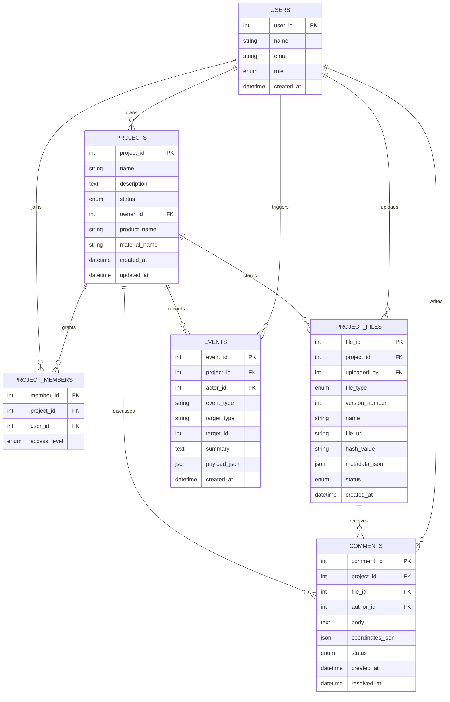
```mermaid
erDiagram
    USERS ||--o{ PROJECTS : owns
    USERS ||--o{ PROJECT_MEMBERS : joins
    PROJECTS ||--o{ PROJECT_MEMBERS : grants
    PROJECTS ||--o{ PROJECT_FILES : stores
    PROJECTS ||--o{ COMMENTS : discusses
    PROJECTS ||--o{ EVENTS : records
    PROJECT_FILES ||--o{ COMMENTS : receives
    USERS ||--o{ PROJECT_FILES : uploads
    USERS ||--o{ COMMENTS : writes
    USERS ||--o{ EVENTS : triggers

    USERS {
        int user_id PK
        string name
        string email
        enum role
        datetime created_at
    }

    PROJECTS {
        int project_id PK
        string name
        text description
        enum status
        int owner_id FK
        string product_name
        string material_name
        datetime created_at
        datetime updated_at
    }

    PROJECT_MEMBERS {
        int member_id PK
        int project_id FK
        int user_id FK
        enum access_level
    }

    PROJECT_FILES {
        int file_id PK
        int project_id FK
        int uploaded_by FK
        enum file_type
        int version_number
        string name
        string file_url
        string hash_value
        json metadata_json
        enum status
        datetime created_at
    }

    COMMENTS {
        int comment_id PK
        int project_id FK
        int file_id FK
        int author_id FK
        text body
        json coordinates_json
        enum status
        datetime created_at
        datetime resolved_at
    }

    EVENTS {
        int event_id PK
        int project_id FK
        int actor_id FK
        string event_type
        string target_type
        int target_id
        text summary
        json payload_json
        datetime created_at
    }
```

### 三層資訊架構

| 層級 | 放置內容 | 設計理由 |
| --- | --- | --- |
| 第一層：日常工作台 | 專案、檔案、留言/標註、時間線、成員、狀態 | 一般使用者每天最常用，必須一眼看懂。 |
| 第二層：專案進階資訊 | 合規資料、工程資料、商務資料 | 功能保留，但只有進入專案且需要時才展開。 |
| 第三層：系統設定 | 使用者管理、材料主檔、產品型錄、組件資料、稽核規則、權限設定 | 管理員維護主檔與規則，不干擾日常協作。 |

第二層的專案進階資訊再分成三組：

| 分組 | 內容 |
| --- | --- |
| 合規資料 | 報告、材料證明、簽核、稽核紀錄。 |
| 工程資料 | 3D 版本、BOM、組件、材料體積與製程資訊。 |
| 商務資料 | 成本、報價前資料、產品套組與外部需求。 |

這樣設計後，功能完整度仍然保留，但使用者不會在第一畫面同時看到材料、產品、BOM、成本、稽核等多個後台入口。

### 核心 API 設計

日常工作台 API 圍繞專案工作流：

| API | 用途 |
| --- | --- |
| `POST /api/v1/projects` | 建立專案。 |
| `GET /api/v1/projects` | 查看可存取的專案。 |
| `GET /api/v1/projects/{id}` | 查看單一專案。 |
| `GET /api/v1/projects/{id}/files` | 查看專案檔案。 |
| `GET /api/v1/projects/{id}/comments` | 查看專案留言。 |
| `GET /api/v1/projects/{id}/events` | 查看專案時間線。 |
| `POST /api/v1/projects/{id}/members` | 新增專案成員。 |

上傳 STL、背景解析、簽核與檔案下載仍然保留。BOM、成本、材料、產品型錄與稽核也仍有 API，但在前端被歸入第二層或第三層，不作為日常工作台的第一入口。

### 前端頁面設計

前端依照三層資訊架構編排，而不是依照資料表名稱編排。

第一層日常工作台：

1. 專案列表：查看目前所有可存取案件。
2. 專案詳情：顯示檔案、留言、時間線、成員與狀態。
3. 檔案頁：支援 3D 模型與一般文件。
4. 留言與標註頁：支援一般留言與 3D 座標標註。

第二層專案進階資訊：

1. 合規資料：報告、簽核、材料證據、稽核紀錄。
2. 工程資料：3D 版本、BOM、組件與材料估算。
3. 商務資料：成本、報價前資料、產品型錄連結與外部需求。

第三層系統設定：

1. 使用者管理。
2. 材料主檔。
3. 產品型錄與組件資料。
4. 稽核紀錄與權限設定。

### 小記

修正版透過調整功能出場順序，讓使用者第一眼就能把專案工作流做清楚，進而能快速上手；需要更深資料時，再進入專案進階資訊或系統設定。這樣既能保留產品型錄、BOM、成本、稽核等完整功能，也符合睿程生醫目前人少、溝通快、但紀錄不足的真實情境。

---

## 八、系統功能與痛點對照

| 痛點 | 系統功能 | 解決方式 |
| --- | --- | --- |
| LINE 傳檔造成版本混亂 | STL 版本管理、hash、時間戳記 | 每一版模型都有明確版本號、上傳者與檔案驗證紀錄。 |
| 材料更換可能造成設計誤用 | 材料資料表與版本強制綁定 | 每一版模型都需選擇材料，材料參數會影響 BOM 與成本計算。 |
| 醫師回饋難以追蹤 | 3D 座標 pin 與 feedback | 回饋直接附著在特定模型版本與座標。 |
| 修改原因無法查清 | Reference Edge 溯源圖 | 版本、回饋、報告與舊版結構形成可視化鏈結。 |
| 法規稽核缺乏證據鏈 | 簽核與 audit log | 每次上傳、修改、簽核都留下不可逆紀錄。 |
| 沒有業務人員 | 公開產品型錄與申請表 | 對外展示產品並收集需求。 |
| 投資人與醫師難理解技術 | 公開產品型錄、需求申請、內部 3D 檢視 | 先提供可落地的產品入口與展示資料，後續可擴充成更完整的互動網站。 |
| 成本與毛利不清楚 | BOM 與成本資料庫 | 集中記錄材料、工時與打樣成本，並在 BOM 查詢時連到器材用途、身體部位與選定 STL 版本；正式報價與毛利可作為後續擴充。 |

## 九、商業模式畫布

Business Model Canvas：上方為 Key Partners、Key Activities、Value Propositions、Customer Relationships、Customer Segments，中間補 Key Resources 與 Channels，下方為 Cost Structure 與 Revenue Streams。

<table>
  <tr>
    <th rowspan="2">Key Partners<br>關鍵夥伴</th>
    <th>Key Activities<br>關鍵活動</th>
    <th rowspan="2">Value Propositions<br>價值主張</th>
    <th>Customer Relationships<br>顧客關係</th>
    <th rowspan="2">Customer Segments<br>目標客群</th>
  </tr>
  <tr>
    <td>
      醫材設計與模型版本管理。<br>
      材料參數、BOM 與成本紀錄。<br>
      醫師回饋、報告與簽核追蹤。<br>
      公開產品型錄與需求收集。
    </td>
    <td>
      專案式合作。<br>
      醫師與工程師協作回饋。<br>
      外部需求申請後由內部人工接洽。<br>
      投資人資訊透明化。
    </td>
  </tr>
  <tr>
    <td rowspan="2">
      骨科醫師與醫院。<br>
      外部打樣廠與材料供應商。<br>
      醫材廠商。<br>
      投資人。<br>
      法規與合規顧問。
    </td>
    <th>Key Resources<br>關鍵資源</th>
    <td rowspan="2">
      以低 IT 成本提供可追溯、可展示、可量化成本的醫材協作平台。<br><br>
      協助小型醫材新創把拓樸優化、客製化骨釘與 3D 模型技術轉化為可管理、可展示、可估價的商業價值。
    </td>
    <th>Channels<br>通路</th>
    <td rowspan="2">
      骨科醫師。<br>
      醫院與診所。<br>
      醫材廠商。<br>
      投資人。<br>
      需要個人化模型或復健模型的病患。
    </td>
  </tr>
  <tr>
    <td>
      拓樸優化技術。<br>
      骨科臨床知識。<br>
      材料參數與 3D 模型檔案。<br>
      專利設計。<br>
      醫師與廠商合作網絡。
    </td>
    <td>
      公開產品型錄。<br>
      需求申請表。<br>
      醫師/醫院合作。<br>
      投資人簡報。<br>
      未來可擴充互動式官網與 FAQ bot。
    </td>
  </tr>
  <tr>
    <th colspan="2">Cost Structure<br>成本結構</th>
    <th colspan="3">Revenue Streams<br>收益來源</th>
  </tr>
  <tr>
    <td colspan="2">
      設計工時。<br>
      3D 列印耗材。<br>
      醫療不鏽鋼打樣費。<br>
      辦公室租金。<br>
      雲端服務與系統維護成本。
    </td>
    <td colspan="3">
      客製化醫材設計服務。<br>
      3D 模型與復健模型銷售。<br>
      醫材產品或套組銷售。<br>
      技術授權。<br>
      與醫院或廠商合作開發。
    </td>
  </tr>
</table>

## 十、系統創新性

本系統的創新性不在於單一功能，而在於把醫材新創最需要的三種能力整合在一起：

1. 研發溯源：不是單純上傳檔案，而是把材料、版本、醫師回饋、報告與簽核串成可追蹤鏈。
2. 技術展示與需求收集：不是只做形象網站，而是先建立公開產品型錄與需求申請入口，讓公司即使沒有業務員，也能開始對外傳遞產品資訊並收集潛在需求。
3. 財務量化：不是單純記帳，而是把每一案的材料、工時與外部打樣連回專案，形成可被投資人檢視的成本基礎，並支援後續擴充正式報價與毛利資料。
4. AI 交接輔助：不是為了炫技，而是讓新同仁、管理者與對外窗口能快速知道下一步要做什麼，降低小型公司最常見的交接與說明成本。

相較於 LINE、雲端硬碟、Excel 或傳統 ERP，本系統更符合小型醫材新創的規模與需求，能以較低成本解決高風險、高價值的核心流程。

## 十一、預期效益

### 1. 管理效益

- 減少 LINE 傳檔造成的版本混亂。
- 提升醫師、工程師與廠商之間的協作效率。
- 讓每一次設計修改都有紀錄可查。
- 降低小團隊靠記憶與口頭溝通管理專案的風險。

### 2. 合規與研發效益

- 建立完整「材料、模型、回饋、報告、簽核」追蹤鏈。
- 未來面對醫療法規稽核時，可提出完整設計決策紀錄。
- 有助於專利、技術授權與產品開發紀錄保存。

### 3. 行銷與業務效益

- 公開產品型錄可成為 24 小時運作的初步線上業務入口。
- 投資人能更快理解公司技術價值。
- 醫師與醫院能更清楚看到產品用途與合作流程。
- 病患能理解個人化模型與復健模型的價值。
- 需求表單可自動收集潛在客戶名單。

### 4. 財務效益

- 可整理單一專案的真實成本基礎，支援後續報價與毛利估算。
- 可建立產品定價基準。
- 有助於未來募資、技術授權、整併或出售團隊。
- 讓公司從「技術很強」進一步變成「技術價值可被量化」。

### 5. 交接與 AI 營運效益

- 新同仁可依角色導覽快速進入工作狀態。
- Demo 與報告時可直接用導覽頁說明系統全貌，降低口頭補充需求。
- AI 摘要可作為未來每日交接、風險提醒、商機整理與工程待辦產生器。
- 讓公司有合理的 AI 預算使用場景，把 AI 從概念轉成可付費的營運工具。

## 十二、系統展示與操作截圖

### 1. 啟動後端與 demo 測資

啟動展示環境時，先在專案根目錄啟動後端服務與必要基礎設施，執行 migration 並重建 demo 資料，接著啟動前端：

```powershell
cd <專案根目錄>
docker compose up -d db redis minio backend
docker compose exec -T backend alembic upgrade head
docker compose exec -T backend python reset_demo_data.py

cd <專案根目錄>\frontend
npm run dev
```

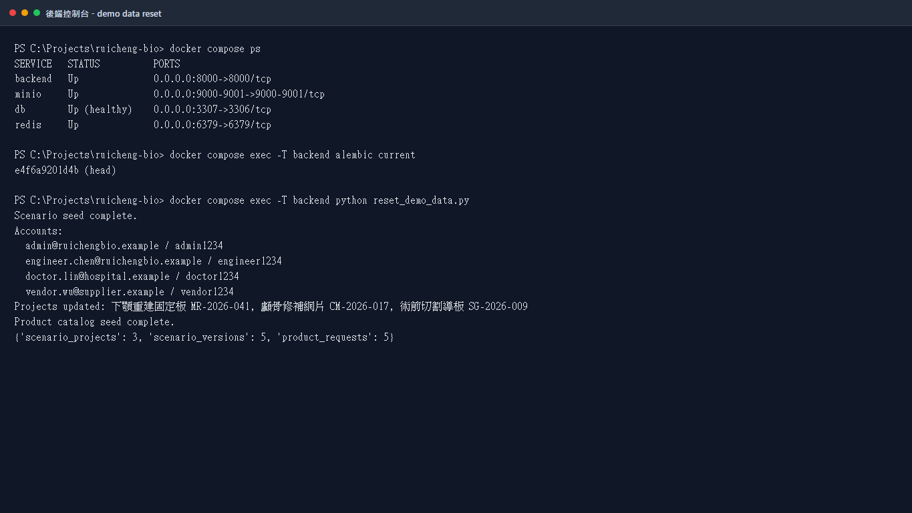

系統以 Docker Compose 啟動後，包含後端、MySQL、Redis、MinIO 等服務。後端會執行 Alembic migration；展示時 migration 位於 `e4f6a9201d4b (head)`。`reset_demo_data.py` 會建立四種 demo 帳號、三個主要 demo 專案、材料、產品型錄、STL 版本、產品套組 BOM、外部申請與報告資料。這一步用來確認助教或使用者 clone 專案後，能在本機重建展示環境。

### 2. 後端 API 文件與服務確認

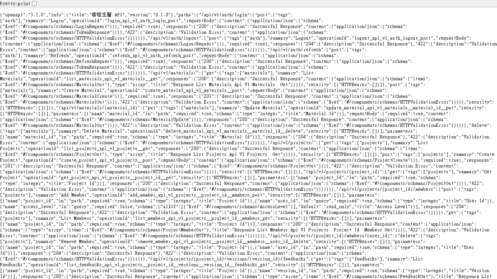

FastAPI 會自動產生 OpenAPI 文件。此畫面用來確認後端 API 已正常啟動，也能看到系統目前提供的 REST API 端點。OpenAPI JSON 顯示目前 API 標題為「睿程生醫 API」，表示後端使用者可見品牌已更新。前端所有專案、產品、使用者、材料、BOM、報告與稽核功能，都是透過這些 API 與後端協作。

### 3. AI 新手導覽與交接入口

新使用者或評審可先打開導覽頁，不需要先理解所有功能。操作流程如下：

```text
開啟 http://localhost:5173/guide
選擇管理員、研發工程師、醫師審閱或業務與對外窗口
依照角色步驟進入公開型錄、登入、專案管理或產品管理
```

導覽頁會把系統拆成角色任務，讓第一次使用的人知道自己應該先看哪個頁面、補哪些資料、以及下一步如何操作。畫面也展示 AI 交接摘要的使用情境，說明未來可由 AI 自動整理今日待處理專案、缺少文件、外部申請與工程待辦。這能回應「功能很多但不容易一眼看懂」的問題，也讓 AI 不是裝飾，而是公司交接、客服、業務與管理追蹤可以付費導入的營運工具。

### 4. 外部申請人：公開產品型錄

外部申請人不需要帳號，也不進入內部系統。操作流程如下：

```text
開啟 http://localhost:5173/catalog
選擇產品
填寫申請人、單位、Email、電話、數量、補充說明
按「送出申請」
```

外部申請人可以查看公開產品套組、查看每個套組包含哪些組件、來源、數量與文件需求，並送出需求申請。此動作只建立申請單，不會自動開通帳號。

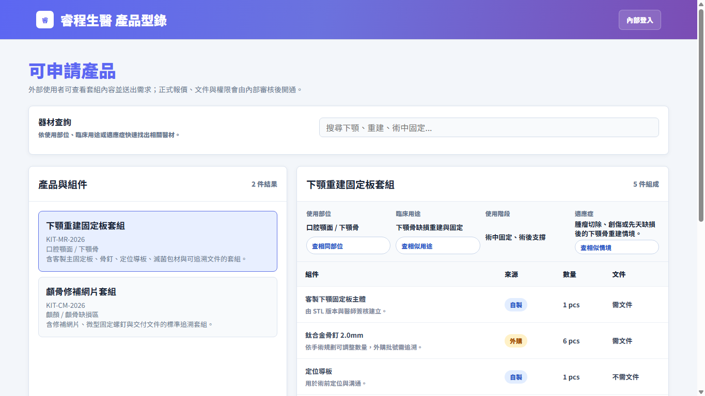

外部訪客不需要登入，即可進入公開產品型錄查看可申請產品。畫面中會呈現產品或套組名稱、說明、使用部位、臨床用途、適應症、組件來源、BOM 數量與文件需求。展示資料中可看到「下顎重建固定板套組」、「顱骨修補網片套組」與「術前切割導板套組」，右側會顯示套組的組件 BOM。使用者也能用關鍵字搜尋，或點選相似部位/用途/情境標籤反查相關器材。這對應到公司「沒有專門業務人員」的痛點，讓網站先成為基本對外展示入口。

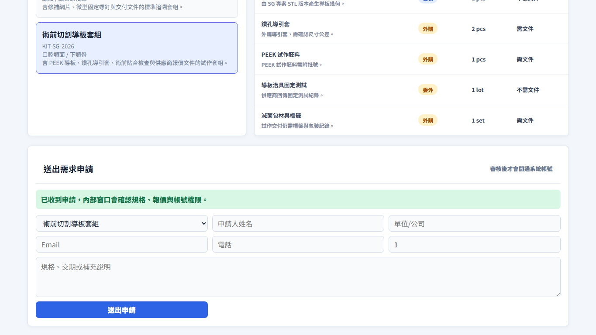

外部訪客填寫姓名、單位、Email、電話、數量與補充說明後，可以送出需求申請。送出後畫面顯示「已收到申請」。系統只建立申請紀錄，不會自動開通內部帳號，後續由管理員在內部產品管理頁查看、審核、更新狀態與追蹤。

### 5. 內部登入入口

所有內部角色都由同一個登入頁進入，登入流程如下：

```text
開啟 http://localhost:5173/login
登入後進入 /projects
```

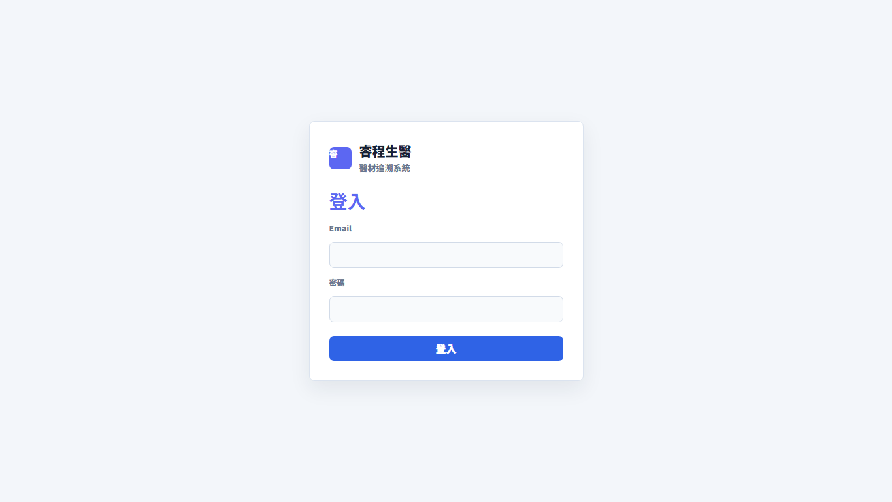

內部角色包含系統管理員、研發工程師、醫師與廠商，皆從同一個登入頁進入。登入後，前端會依照 JWT token、全站角色與專案成員權限，決定使用者可看到與可操作的功能。

### 6. 系統管理員：專案、產品、材料、使用者與稽核

系統管理員 demo 帳號如下：

```text
admin@ruichengbio.example / admin1234
```

登入後進入 `/projects`，並可前往 `/product-admin`、`/admin/materials`、`/admin/users`、`/admin/audit`。管理員可以查看所有專案與專案統計、建立專案並選擇要連結的產品套組、管理產品與組件、編修產品 BOM、查看並更新外部需求申請狀態，以及管理材料、使用者與全站稽核紀錄。

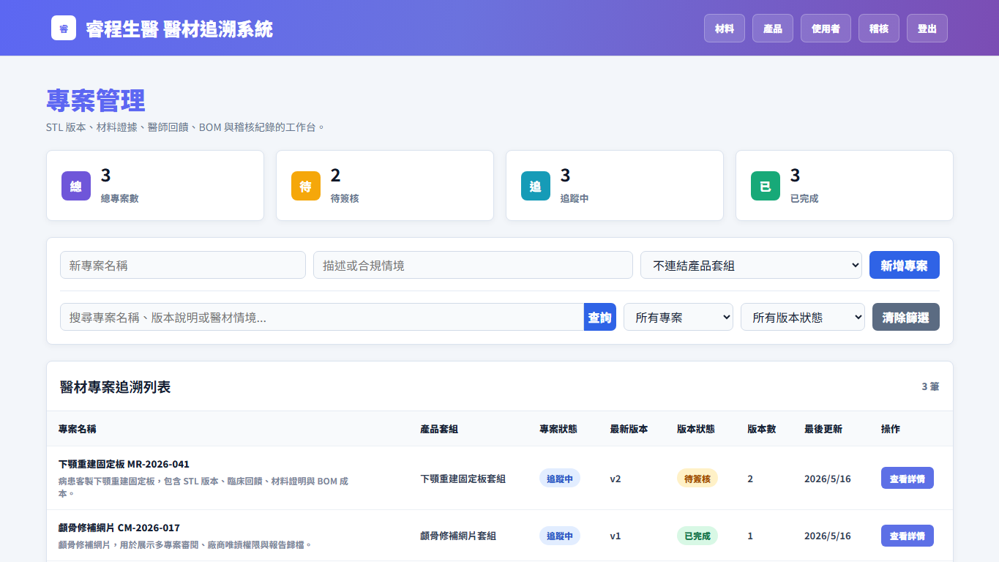

管理員登入後可看到所有專案與專案統計。專案列表已顯示「產品套組」欄位，例如顱骨修補網片專案已連到顱骨套組，術前切割導板專案則連到 PEEK 導板套組，讓內部專案能同時管理 STL 模型版本與產品 BOM。

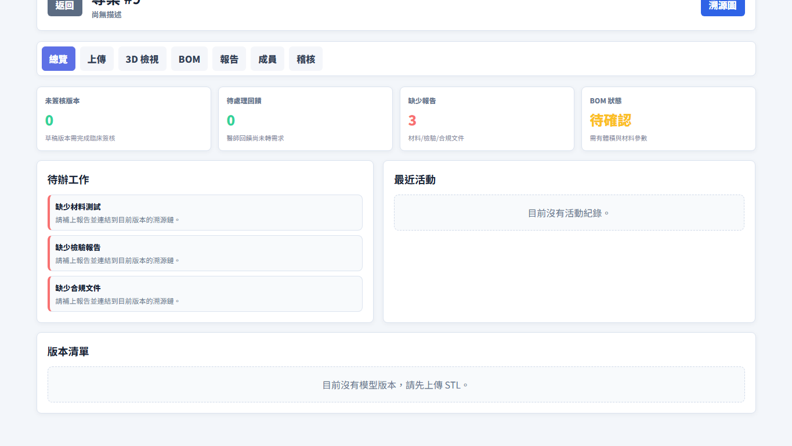

管理員進入「術前切割導板 SG-2026-009」後，可以在總覽頁看到目前版本狀態、待處理回饋、缺少報告、BOM 狀態與最近活動。此專案展示兩版 STL、醫師回饋、供應商報價摘要與 PEEK 試作成本，能用來說明新增 demo 測資如何支撐一個較完整的醫材協作案例。

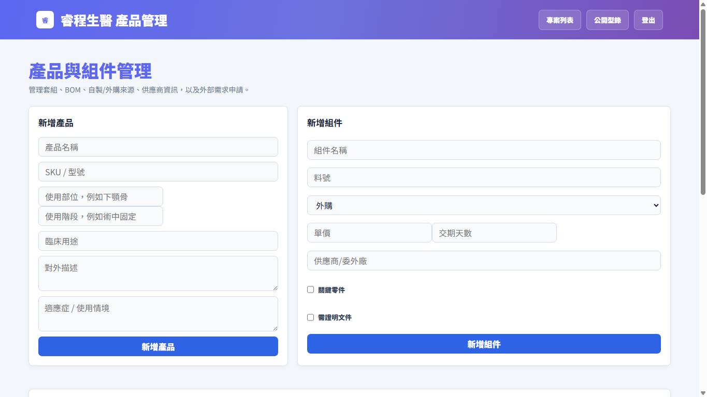

產品管理頁可新增產品、建立組件，並將自製、外購、委外或客供組件加入產品 BOM。產品資料也會記錄使用部位、臨床用途、使用階段與適應症，讓套組 BOM 不只是零件清單，而能對應到實際醫療器材的使用情境。

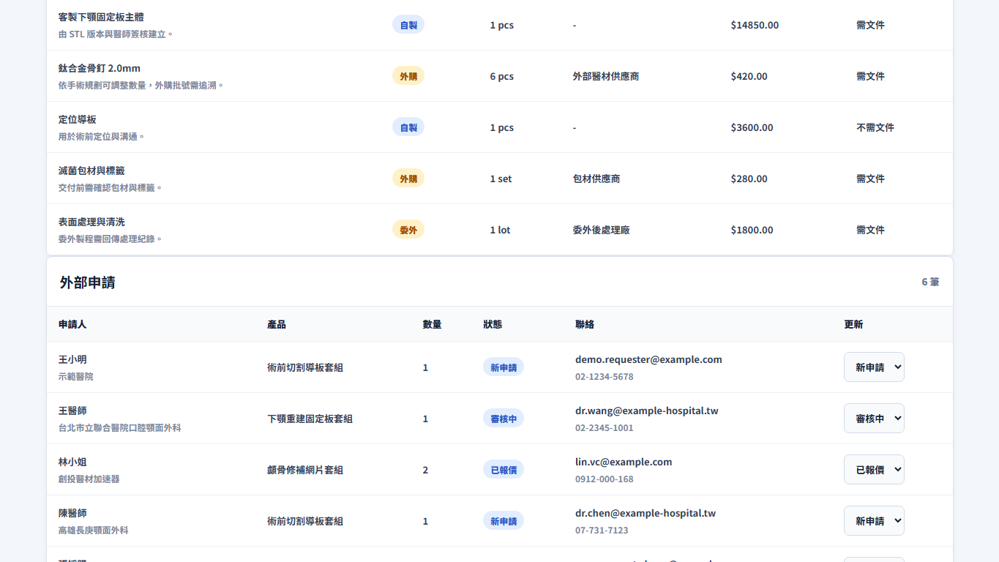

公開型錄送出的需求會進入外部申請列表。管理員可以查看申請人、單位、聯絡方式、需求數量與狀態，並將申請狀態改為新申請、審核中、已報價、已核准或已拒絕。

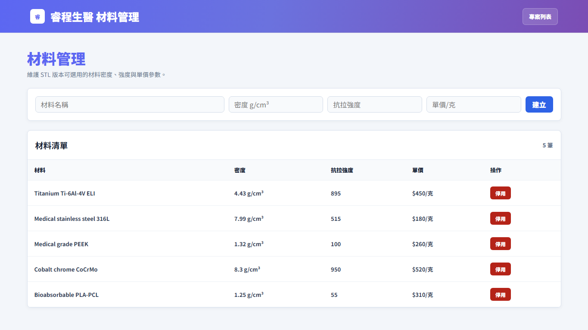

材料管理頁維護材料密度、抗拉強度、單價等物理參數。這些材料資料會被模型版本引用，並用於 STL 材料成本與 BOM 計算。

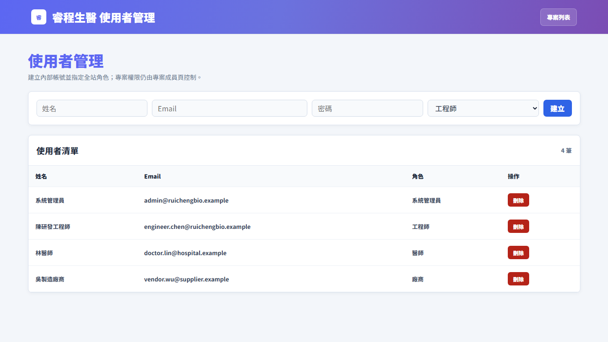

使用者管理頁可建立或刪除內部帳號，角色包含工程師、醫師、廠商與系統管理員。此功能支援公司在未來擴張時管理不同協作對象。

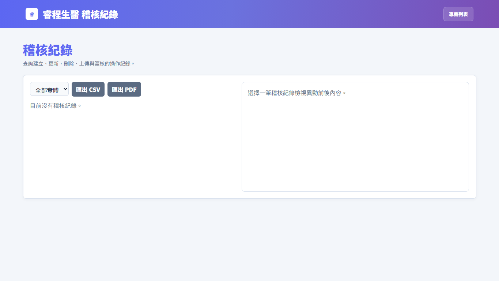

稽核頁會記錄建立、更新、刪除、上傳、簽核與材料變更等操作，也可篩選操作實體並匯出 CSV/PDF。當面臨法規稽核或內部追蹤時，可以回查誰在什麼時間對哪筆資料做了什麼事。

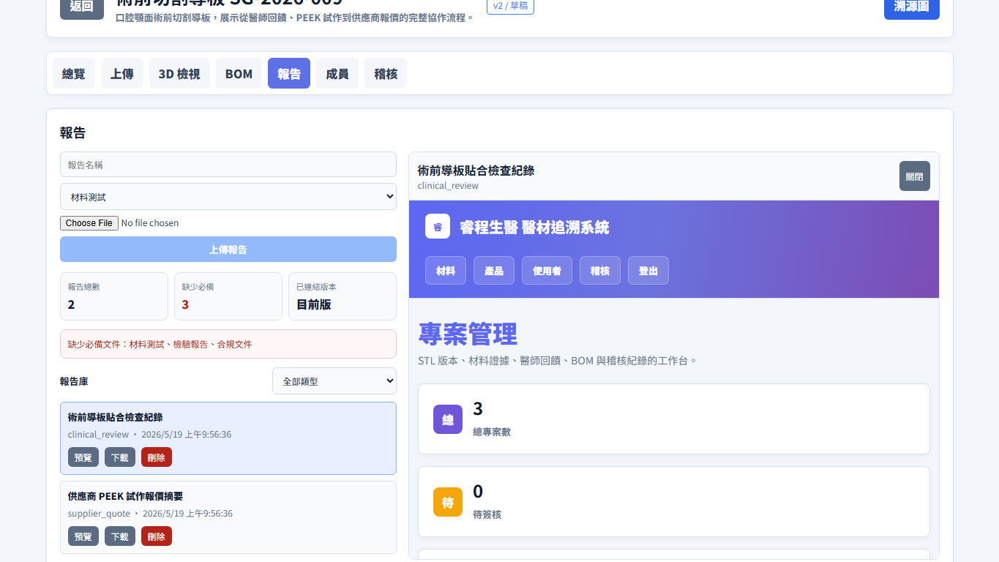

報告分頁可集中管理材料測試、檢驗、合規、製造、滅菌或供應商文件。畫面中的術前切割導板案例已放入「術前導板貼合檢查紀錄」與「供應商 PEEK 試作報價摘要」，用來展示報告不只是附件，而是會與模型版本、醫師回饋與後續決策串接。

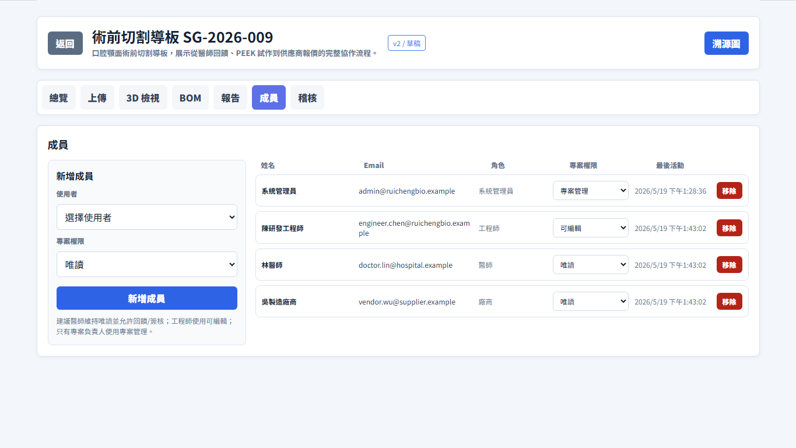

成員分頁可管理同一專案中的工程師、醫師與廠商權限。工程師通常具有可編輯權限，醫師與廠商預設唯讀；醫師仍可在 3D 檢視中留下回饋或執行簽核，廠商則只看必要資料，避免外部協作者誤改核心紀錄。

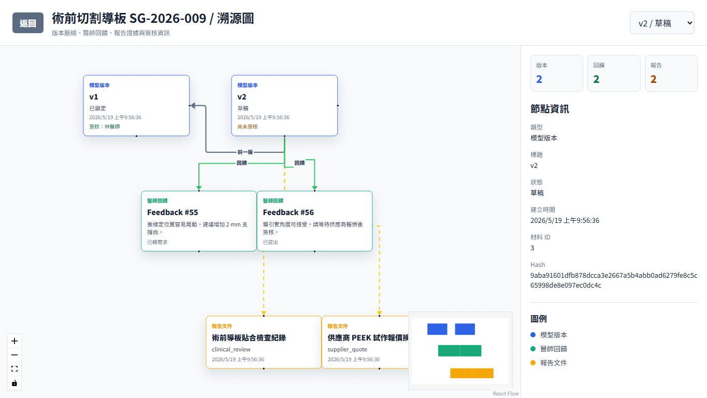

溯源圖會把 STL 版本、醫師回饋與報告文件畫成節點關係。術前切割導板案例中，v2 可以回溯到 v1、兩筆醫師回饋與兩份報告，右側也會顯示版本狀態、材料 ID、hash 與簽核資訊。這是本系統和單純雲端硬碟最大的差異：資料不是只被存放，而是被結構化地追蹤。

### 7. 研發工程師：STL 上傳與 BOM 成本

研發工程師 demo 帳號如下：

```text
engineer.chen@ruichengbio.example / engineer1234
```

操作流程如下：

```text
開啟 http://localhost:5173/login
登入後進入 /projects
開啟專案
使用「上傳」「BOM」「報告」等分頁
```

工程師可以查看自己被授權的專案、上傳 STL 版本、選擇材料與父版本、查看 worker 上傳狀態與版本鏈、輸入工時成本與外部打樣成本、查看產品套組 BOM，確認哪些零件自製、外購或委外，也可以上傳材料、檢驗、合規等報告。正式報價金額目前可由外部申請狀態與供應商報價文件輔助管理，後續可擴充成獨立報價模組。

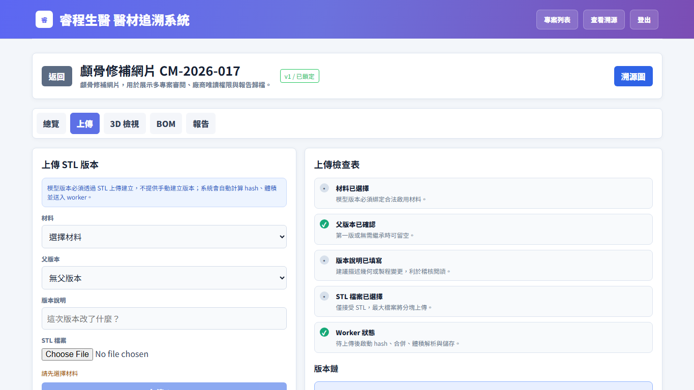

工程師進入專案後，可以在上傳分頁選擇材料與 STL 檔案。上傳 STL 前必須選材料與檔案；系統會透過 STL 流程建立版本，不允許手動建立沒有檔案、hash 或體積資料的假版本。

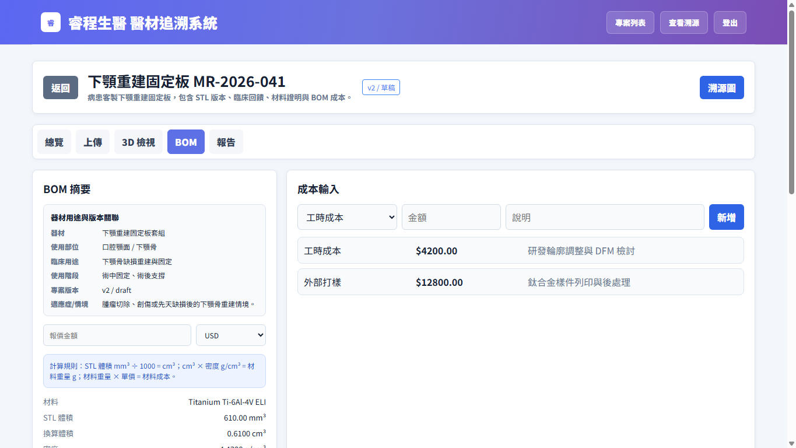

BOM 分頁會顯示 STL 材料成本、工時或外部打樣成本，也會顯示專案連結的產品套組零件 BOM。BOM 分頁左側是 STL 材料成本，右側可新增工時或外部打樣成本；下方可看到顱骨修補網片套組的微型固定螺釘 x8、滅菌包材與標籤，也可展示術前切割導板套組的 PEEK 胚料、鑽孔導引套與治具固定測試等項目。新版 BOM 摘要會在最上方顯示器材名稱、使用部位、臨床用途、使用階段、適應症與目前 STL 版本，因此可以直接看出「這個成本是用在哪個器材、哪個身體部位與哪一版模型」。這對應到公司目前成本分散、難以整理單案成本基礎的痛點，也為後續報價與毛利估算提供依據。


### 8. 醫師：3D 檢視與版本回饋

醫師 demo 帳號如下：

```text
doctor.lin@hospital.example / doctor1234
```

操作流程如下：

```text
開啟 http://localhost:5173/login
登入後進入 /projects
開啟專案
使用「3D 檢視」提出回饋
必要時填寫簽核理由與密碼完成簽核
```

醫師可以查看授權專案與模型版本，在 3D 檢視中旋轉、平移、剖面檢查模型，針對版本留下文字回饋或 3D 座標註記，也可對 draft 版本執行簽核。簽核後版本會鎖定並留下稽核紀錄。

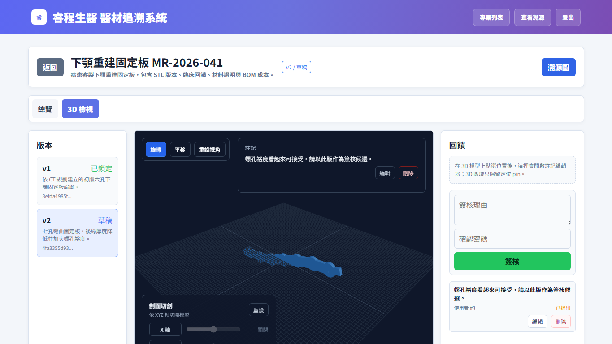

醫師登入後可進入授權專案，在 3D 檢視中查看模型，並針對特定版本留下文字回饋或座標註記。醫師在 3D 檢視分頁送出 demo 回饋後，回饋會出現在右側清單，工程師可依此建立後續版本或處理紀錄。這些回饋會被系統保存，後續版本可引用回饋作為修改依據，形成可追蹤的設計決策鏈。

### 9. 廠商：唯讀協作

廠商 demo 帳號如下：

```text
vendor.wu@supplier.example / vendor1234
```

操作流程如下：

```text
開啟 http://localhost:5173/login
登入後進入 /projects
開啟被授權專案
使用總覽與 3D 檢視
```

廠商可依專案授權查看資料。預設為唯讀，不顯示上傳、BOM 成本輸入、成員管理等內部操作，但可查看版本狀態、最近活動與 3D 模型。

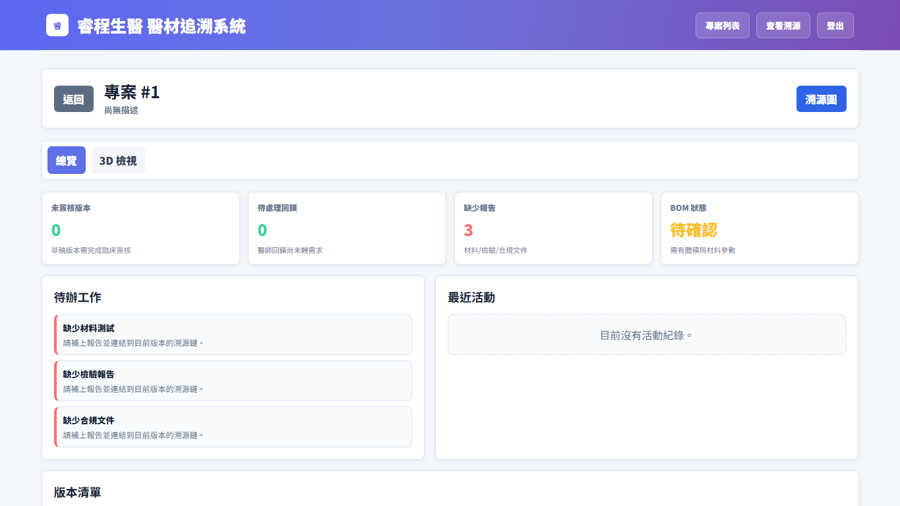

廠商登入後只會看到被授權的專案資料，預設為唯讀。系統不會顯示上傳、成本輸入、成員管理或簽核等內部操作，避免外部協作者誤改核心資料。廠商進入專案後只看到允許的總覽與檢視功能，不會看到管理員或工程師的管理入口。

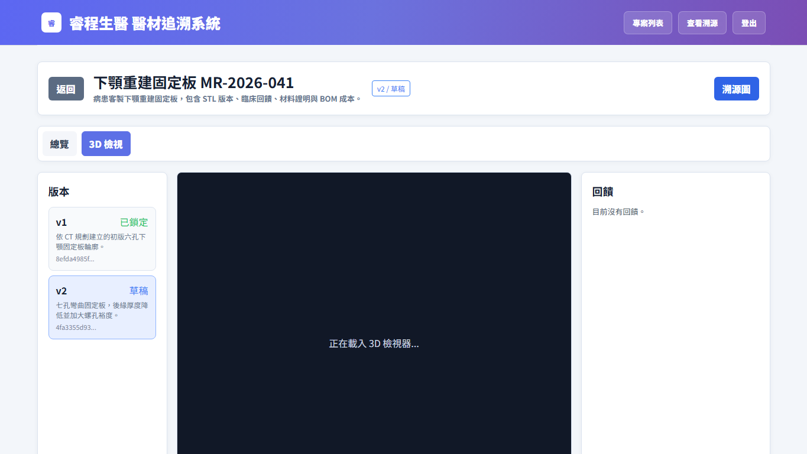

廠商可查看模型、版本與基本專案資訊，用於理解製作需求或對接打樣流程。這讓外部廠商能參與協作，但權限仍受控於系統。廠商可檢視模型與版本資訊，但不能進行內部成本、材料、成員或簽核管理。
