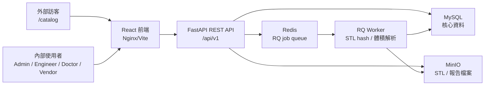
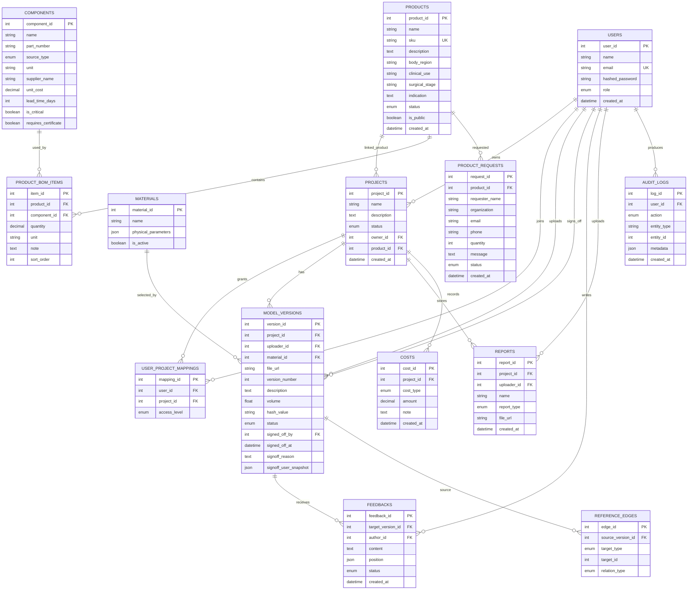
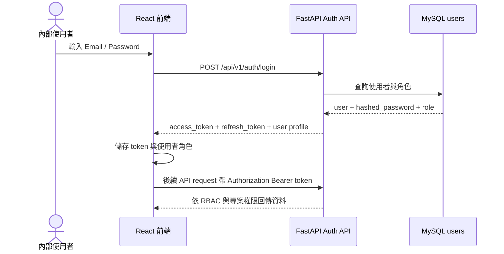
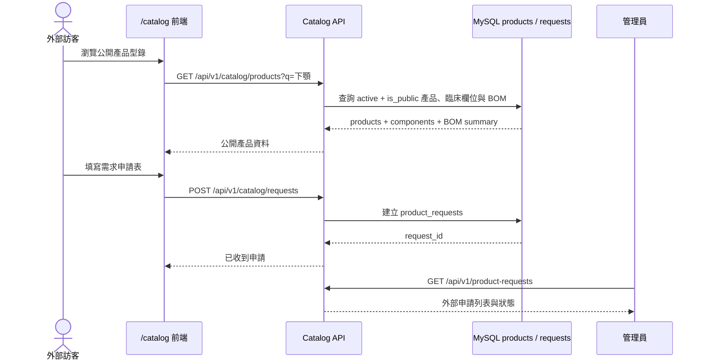
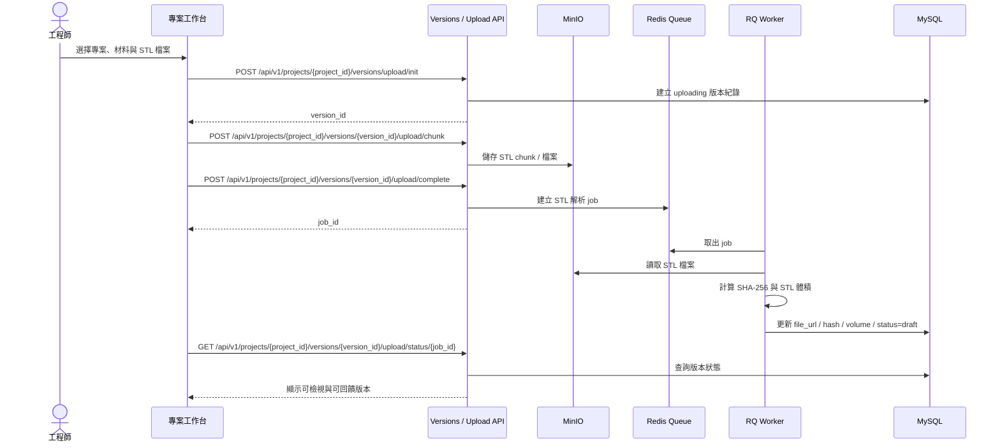
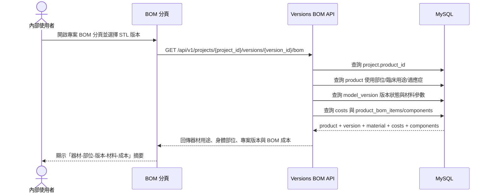

## 零、前言

本專案合作對象為「睿程生醫」，是一間技術導向的醫材新創公司。公司核心技術能力很強，創辦背景來自骨科臨床需求，父親本身是骨科醫師，能直接從手術與復健現場發現問題，並自行研發對應產品。睿程生醫目前正在發展 3D modeling、手術輔助器材、拓樸優化、生化材料與客製化骨釘等技術。

然而，公司目前的問題不在於技術本身，而在於管理、溝通、行銷與商業化能力跟不上技術成熟度。公司實際在辦公室的人不到五人，內部溝通主要依賴 LINE，研發紀錄與設計修改歷程沒有被完整結構化保存；同時也沒有專責業務人員或完整網站，導致公司難以向投資人、醫師、醫院與病患有效傳遞產品價值。

因此，本專案的核心目標不是建立一套龐大的企業系統，而是以最低 IT 成本建置一套輕量級資訊系統，協助公司解決兩個最迫切的問題：

1. 研發協作與醫材檔案溝通混亂。
2. 缺乏業務與對外資訊傳遞管道。

本系統以「雲端協作、公開產品型錄、輕量資料庫」為核心，把錢花在刀口上，讓小型醫材新創不必承擔傳統 ERP 的高成本與高維護負擔，也能讓拓樸優化與客製化醫材技術更容易被理解、追蹤與商業化。

## 一、合作公司與現況

### 1. 公司成立原因

睿程生醫成立的主要原因，是希望解決醫生、醫院與醫材設計之間的法規、溝通與產品開發問題。醫療輔助器材與客製化醫材常需要醫師、設計端、廠商與病患之間來回確認，但目前流程多仰賴人工溝通，容易產生延遲與紀錄不足。

### 2. 目前主要業務與技術方向

公司目前的工作內容包含：

- 3D modeling 設計醫療輔助器材。
- 製作模型給病人理解手術或復健狀況。
- 製作模型給廠商理解產品結構與製造需求。
- 研發手術中、手術後使用的輔助固定器。
- 探索病人購買個人化模型的可能性，例如紀念、理解病況或復健用途。
- 發展拓樸優化與生化材料客製化骨釘。

拓樸優化是公司未來的重點方向。透過 AI 算力提升，設計端可以設定材料、受力點與目標條件，讓電腦自動產生更有效率的結構模型。這項技術具有客製化、高技術門檻與醫療應用潛力，但也需要更完整的資料管理、材料參數紀錄、版本追蹤與對外展示方式。

### 3. 組織規模與資訊工具

公司人數約十幾人，但實際在辦公室的人不到五人。團隊對資訊工具接受度高，目前內部主要使用 LINE 溝通，但較少有正式紀錄。目前也沒有人員專門負責銷售、業務開發或投資人簡報。

這代表公司不適合導入大型 ERP，但非常適合導入一套輕量、可快速上手、只針對關鍵流程設計的資訊系統。本專案目前實作重點放在內部醫材協作平台、公開產品型錄、外部需求申請與專案成本/BOM 管理；更完整的 Apple 式官網、AI FAQ bot 與投資人專區可列為未來擴充，而不是本次 demo 的主體。

## 二、訪談紀錄整理

### 1. 訪談前觀察

原 proposal 的問題是缺乏特殊性，也缺乏對合作公司的深入理解。經過訪談後，本組發現公司真正的痛點不是單純「需要網站」或「需要資料庫」，而是：

- 技術很強，但缺乏能把技術轉換成商業價值的資訊介面。
- 醫材設計涉及材料、版本、醫師回饋與法規稽核，但目前紀錄不夠完整。
- 公司規模小，不適合高成本、複雜度高的管理系統。

### 2. 公司營運流程

公司目前會依照醫療或產品需求進行 3D modeling，設計出的模型主要提供給兩類對象：

1. 病人：讓病人理解手術、術後狀況或復健模型。
2. 廠商：讓製造端理解產品結構與製作需求。

例如手術線拉線很細、不好操作，公司會思考是否能在器材上增加金屬環，讓產品更人性化。部分設計圖涉及專利，不能完整公開，但可以使用相似或展示用模型呈現技術能力。

目前公司正在做 tadcad、拓樸優化、生化材料與客製化骨釘。客製化骨釘發展潛力大，但制約也多，包含法規、材料、製程與醫療責任，因此更需要完整的版本與材料紀錄。

### 3. 對外網站需求

訪談中提到，網站造訪者主要有三類：

- 投資人。
- 骨科醫師與醫院。
- 病人。

公司希望網站給人的感受是「創新、有效率、專業」。內容應包含產品、技術、優化參數、材料規格與醫療執照。分類方式可依照術前、術中、術後，或依照身體部位進行整理。

呈現方式上，公司偏好類似 Apple 官網的風格：清楚展示產品、規格、對照與互動效果，不需要過度花俏。網站可透過旋轉產品、結構放大、功能解釋與術前術後對照，讓抽象的拓樸優化技術變得容易理解。

訪談時也提到可加入線上洽談、問答 bot、常見問題與 AI 功能。不過目前公司尚未建立完整 FAQ，因此初期可先建立基礎問答與留單機制，後續再逐步擴充。

### 4. 成本與利潤現況

目前成本來源分散，包含：

- 居家 3D 印表機。
- 3D 列印耗材。
- 醫療不鏽鋼等外部打樣費用。
- 辦公室租金，約每月 15,000 至 20,000 元。

公司未來可能考慮技術授權、賣給其他團隊或進行更大規模的商業合作。如果沒有單一專案的真實成本、毛利與定價資料，將很難向投資人或收購方證明技術的商業價值。

## 三、訪談逐字稿整理版

### 1. 訪談開場與公司背景

**小組員：** 我們想先了解一下公司成立的原因。當初為什麼會開始做這個醫材相關的公司？

**睿程負責人：** 一開始主要是想解決醫生、醫院跟醫材設計之間的一些法規和溝通問題。因為醫療器材不是一般產品，很多東西不能只是做出來，還要能說明它為什麼這樣設計、怎麼使用、跟臨床需求有什麼關係。

**小組員：** 所以公司比較偏技術研發導向？

**睿程負責人：** 對，技術是比較核心的部分。像我們會做 3D modeling，設計一些手術輔助器材，也會做模型給病人看，或是給廠商看。現在也有在看拓樸優化、生化材料跟客製化骨釘這類方向。

**小組員：** 拓樸優化可以簡單說明一下嗎？

**睿程負責人：** 它比較像是一種設計概念。以前設計結構可能要靠工程師反覆調整，但現在 AI 算力提升後，可以設定目的、受力點或限制條件，讓電腦去跑出比較有效率的模型。這件事應用到客製化醫材會很有潛力。

**小組員：** 公司目前大概有多少人？

**睿程負責人：** 全部加起來大概十幾個，但真的會在辦公室的人不到五個。

### 2. 現行作業與內部溝通

**小組員：** 平常公司內部怎麼溝通？例如設計圖、模型或修改意見。

**睿程負責人：** 目前主要還是用 LINE。大家比較習慣，用起來也快。

**小組員：** 那會有版本混亂的問題嗎？

**睿程負責人：** 目前還沒有到很嚴重，因為人不多，大家大概知道現在用的是哪一版。不過如果之後案子變多，或要跟更多醫生、廠商合作，可能就會比較麻煩。

**小組員：** 目前修改紀錄會特別保存嗎？

**睿程負責人：** 沒有很完整。比較多是靠 LINE 訊息、口頭討論，或是檔案名稱自己註記。正式的紀錄沒有做得很完整。

**小組員：** 如果未來遇到醫療法規稽核，會需要知道每一版是為什麼修改的嗎？

**睿程負責人：** 這會需要。醫材跟一般產品不一樣，如果要證明設計過程或材料選擇，就不能只拿最後一版檔案，最好要知道前面怎麼改、為什麼改、誰確認過。

### 3. 產品、技術與未來方向

**小組員：** 現在公司主要做哪些產品或應用？

**睿程負責人：** 目前會做 3D 模型，讓病人看，也讓廠商看。有些是手術輔助器材，有些是術後或復健相關的模型。像手術線很細不好拉，我們可能會設計一個金屬環，讓使用上更人性化。

**小組員：** 有些設計可以公開展示嗎？

**睿程負責人：** 有些不行，因為涉及專利。但可以做類似展示用的模型，讓外部的人理解技術方向。

**小組員：** 未來最想發展的是哪一塊？

**睿程負責人：** 拓樸骨釘是很重要的方向。客製化骨釘潛力大，但限制也多，像材料、法規、製程都要考慮。

**小組員：** 病人會想買自己的模型嗎？

**睿程負責人：** 有可能。有些人可能覺得有趣，有些人可能是復健或理解病況需要。這可以是一個方向。

### 4. 對外網站與行銷需求

**小組員：** 目前有人負責銷售或業務嗎？

**睿程負責人：** 目前沒有專門的人負責銷售。

**小組員：** 如果做網站，你們覺得主要會給誰看？

**睿程負責人：** 主要可能是投資人、骨科醫師或醫院，還有病人。

**小組員：** 這三種人看到的內容需要不一樣嗎？

**睿程負責人：** 一開始想法是可以不用差太多，整體看起來專業一點，偏重技術講解。但不同對象關心的事情確實不太一樣，投資人可能看技術和商業價值，醫師看臨床用途，病人看術前術後或復健。

**小組員：** 網站應該呈現哪些內容？

**睿程負責人：** 產品、技術、優化參數、材料規格、執照。分類可以用術前、術中、術後，或是用身體部位來分。

**小組員：** 呈現方式有偏好的風格嗎？

**睿程負責人：** Apple 那種不錯，展示、規格說明、對照都很清楚，不用太花俏。可以旋轉產品、放大結構、解釋功能，讓人知道我們可以做到哪些事。

**小組員：** 會需要線上洽談或問答功能嗎？

**睿程負責人：** 可以。有 FAQ bot 或 AI 問答應該不錯，但目前還沒有整理完整問題集。

### 5. 成本、利潤與商業化

**小組員：** 目前成本主要包含哪些？

**睿程負責人：** 有些是在家用 3D 印表機印，會有耗材成本。實際做醫療不鏽鋼打樣也會有打印費用。另外辦公室租金大概一萬五到兩萬。

**小組員：** 目前會把這些成本集中記錄嗎？

**睿程負責人：** 沒有很完整。很多成本是分散的。

**小組員：** 如果要算單一產品毛利，現在容易算嗎？

**睿程負責人：** 不容易。因為工時、耗材、外包打樣、租金攤提都要算進去，但目前沒有一個系統統整。

**小組員：** 未來會考慮技術授權、募資或賣給其他團隊嗎？

**睿程負責人：** 有可能。所以如果能有比較清楚的成本、毛利和專案資料，對未來談合作或投資會比較有幫助。

### 6. 對系統方向的確認

**小組員：** 所以我們理解下來，公司不一定需要大型 ERP，比較需要的是一套輕量系統，把模型、版本、材料、回饋、報告和成本整理起來，對外再有一個產品型錄或展示入口，這樣理解對嗎？

**睿程負責人：** 對。ERP 對我們來說太大了，現在人少，用不到那麼多功能。如果可以用比較低成本的方式，先解決溝通、紀錄、展示和成本問題，會比較實際。

**小組員：** 內部協作平台的部分，我們會讓 3D 模型集中上傳，版本綁定材料，醫師可以回饋，系統能留下修改紀錄和簽核紀錄。這樣對未來法規或專利證明也比較有幫助。

**睿程負責人：** 這個方向是有幫助的。醫療器材如果之後要更正式地往外推，紀錄跟追蹤會很重要。

**小組員：** 對外展示部分，這次系統會先做公開產品型錄和需求申請，讓外部的人至少能看到產品和留下需求。更完整的互動網站或 AI bot 可以放在未來擴充。

**睿程負責人：** 可以，先有一個入口也很好，不然現在其實沒有一個地方可以清楚介紹產品和收需求。

**小組員：** 成本資料庫的部分，我們會把材料成本、工時、外部打樣和報價綁到專案，讓每一案可以算 BOM 和毛利。

**睿程負責人：** 這也很需要。之後如果要跟投資人或其他團隊談，不能只講技術，也要有數字。

## 四、具體痛點分析

### 痛點一：用 LINE 溝通早晚出事，存在合規風險

醫療設計需要反覆修改，且每次修改都可能與醫師回饋、材料規格、測試報告或舊版結構有關。目前若使用 LINE 傳遞 3D 模型，短期看似方便，但長期會出現以下問題：

- 版本容易混亂。
- 歷史檔案難以搜尋。
- 修改原因與設計決策沒有被結構化保存。
- 醫師或廠商回饋無法穩定連到特定模型版本。
- 未來面對醫療法規稽核時，無法完整提出設計決策紀錄。

對醫材公司而言，檔案本身不是唯一重點，真正重要的是能回答「誰在何時基於哪個回饋、哪份報告、哪個材料參數做了什麼修改」。LINE 無法支援這種研發歷程追蹤。

### 痛點二：技術強但賣不掉，缺乏業務力

公司沒有專責業務，也沒有足以承接投資人、醫師、醫院與病患需求的網站。拓樸優化、生化材料與客製化骨釘本身具有高度技術價值，但一般人很難直接理解。

缺乏對外資訊媒介會造成：

- 投資人難以快速理解公司技術壁壘。
- 醫師與醫院不知道產品如何導入臨床流程。
- 病患不知道個人化模型或復健模型的價值。
- 潛在客戶需要大量人工解釋，溝通成本過高。
- 沒有人主動收集需求與名單，商機容易流失。

因此，公司需要一個可以 24 小時運作的線上業務窗口，把技術、產品、材料規格與合作流程說清楚。

### 痛點三：算不出真實毛利，存在財務盲點

公司成本分散在耗材、外包打樣、租金與設計工時中，但目前沒有集中管理。若只知道產品可以做出來，卻不知道每一件產品的真實成本與利潤，就無法建立穩定定價策略。

這會造成：

- 無法判斷單一專案是否賺錢。
- 無法比較不同產品線或材料方案的毛利。
- 難以向投資人說明商業可行性。
- 未來若要技術授權、募資或出售團隊，缺乏可信的財務數據。

對新創公司而言，技術價值必須搭配財務數據，才能轉化為投資人或合作方願意相信的商業價值。

## 五、既有解法比較

### 1. 為什麼不用市面上的 ERP？

傳統 ERP 適合中大型企業，用來管理採購、庫存、會計、人資、生產排程與跨部門流程。但合作公司實際在辦公室的人不到五人，若導入完整 ERP，會遇到以下問題：

- 導入成本過高。
- 功能過度肥大，許多模組用不到。
- 維護與教育成本高。
- 小團隊反而會被系統流程拖慢。
- ERP 並不擅長處理醫材 3D 模型版本、材料參數、醫師回饋與設計溯源。

因此，對這間公司而言，傳統 ERP 是殺雞用牛刀。真正需要的不是完整企業資源規劃，而是一套專注在「研發協作、對外展示、成本紀錄」的輕量資訊系統。

### 2. 為什麼不用雲端硬碟或 LINE？

雲端硬碟可以集中存檔，但無法強制要求每一版模型綁定材料、醫師回饋、測試報告與簽核紀錄。LINE 更偏向即時溝通，缺乏版本控制、權限管理、稽核紀錄與資料結構。

本系統與一般工具的差異在於：它不是只存檔，而是把每一份檔案放回醫材研發脈絡中，建立「材料、版本、回饋、報告、成本、簽核」之間的關聯。

### 3. 為什麼用我們的系統？

我們的系統主打把錢花在刀口上，用最低 IT 成本建立三個公司目前最需要的能力：

1. 雲端協作：讓模型、材料、回饋、報告與簽核集中管理。
2. 公開產品型錄：讓投資人、醫師、醫院與病患能先理解公司產品方向並留下需求。
3. 輕量資料庫：讓每一案的材料、工時與外部打樣成本被記錄，作為後續報價與毛利估算基礎。

這套系統不追求包山包海，而是直接解決「溝通混亂」與「沒人跑業務」兩大致命傷，協助公司的拓樸優化技術更容易變現。

## 六、具體資訊系統解方

### 解方一：輕量級雲端協作平台

此平台用來解決合規、溝通盲區與參數溯源問題。

#### 具體作法

重要醫材檔案改由專屬 Web 平台集中上傳與管理，LINE 僅保留即時通知或非正式溝通，避免 STL、材料、報告與回饋散落在聊天紀錄中。

#### 自動版本控制與原料參數綁定

3D 模型圖檔集中上傳後，系統自動綁定時間戳記、版本號與上傳者。每一版設計建立時，系統強制要求選擇對應原料，例如醫療不鏽鋼、生化材料或鈦合金。

不同原料會關聯不同物理參數與優化邏輯，確保設計變更與材料特性完全對齊，避免因材料更換導致模型設計誤用。

#### 關聯式修改追蹤與引用機制

每一次版本修正不再只是覆蓋舊檔，而是必須註記修正關聯。系統會自動建立鏈結，標註此版本是參考哪一次醫師回饋、哪一份材料測試報告，或是哪一個舊版結構進行調整。

這會形成網狀資料結構，讓每一處修改都有據可查。此設計也能展現資訊管理中典型的多對多資料整合能力。

#### 線上審核與協作

醫師與廠商可以直接在對應模型版本下留言回饋，系統自動將回饋轉化為下一版本的需求引用來源。最後透過數位確認流程完成簽核，簽核後版本鎖定，保留不可逆稽核紀錄。

#### 具體成效

- 設計資料高度結構化。
- 原料特性與設計修正強制關聯。
- 可自動產出材料與設計對照表。
- 可建立完整研發歷程鏈。
- 面對醫療法規稽核時，可匯出「材料、需求、修正、確認」的完整邏輯鏈。
- 可作為合規、專利與商業合作證明。

### 解方二：公開產品型錄與需求申請入口

此功能用來解決零業務員與對外資訊傳遞不足的問題。訪談中提到，公司未來希望網站能像 Apple 官網一樣用互動方式展示產品，也希望有 FAQ bot 或 AI 問答；但公司目前尚未整理完整問題集，本次專案也以可完成、可展示、可落地的範圍為主，因此先實作公開產品型錄與需求申請表，作為自動化銷售網站的第一階段。

#### 具體作法

公開頁面提供外部使用者不需登入即可瀏覽的產品入口，內容包含：

- 產品或套組名稱。
- 產品描述。
- 組件來源。
- BOM 數量。
- 文件需求。
- 需求申請表。

外部訪客可以透過產品型錄理解公司目前可展示的產品方向，並留下姓名、單位、Email、電話、需求數量與補充說明。系統收到申請後，不會自動開通帳號，而是進入內部產品管理頁，由管理員後續審核、報價或聯繫。

系統支援依使用部位、臨床用途與適應症查詢器材，使用者可點選相似情境標籤，快速列出相關醫材，協助醫師、病患或投資人從臨床問題反查可用產品。

#### 受眾分流的處理方式

訪談時提到網站可能有三種主要受眾：投資人、骨科醫師/醫院、病人。最初訪談中也提到「看到的內容可以一樣，整體看起來專業一點、偏重技術講解」。因此本次系統先採用共同產品型錄入口，不做過度複雜的分眾頁面。

若未來擴充，可再增加：

- 投資人路徑：強調技術壁壘、拓樸優化參數、成本與毛利資料。
- 醫師/醫院路徑：強調臨床應用、材料規格、手術輔助器材與合規文件。
- 病人路徑：強調術前術後對照、個人化模型與復健用途。

#### 未來擴充方向

Apple 式 3D 互動展示與 AI FAQ bot 適合作為後續版本。系統可在既有公開型錄上加入 WebGL 互動模型、滾動式產品說明、FAQ 資料庫與自動留單機制。但在本次專案中，已完成的重點是建立最小可行的對外入口，先讓公司有地方展示產品、接收需求，並把需求流入內部管理系統。

#### 具體成效

- 讓公司即使沒有業務員，也有基本對外展示入口。
- 降低投資人、醫師、醫院與病患初步理解產品的門檻。
- 自動收集潛在客戶名單。
- 讓外部需求不再散落於 LINE 或口頭訊息。
- 內部管理員可在產品管理頁追蹤申請狀態。

### 解方三：專案成本資料庫

此資料庫用來建立財務透明度與未來擴張籌碼。

#### 具體作法

建置基礎關聯式資料庫與簡易輸入介面，讓內部人員可以將每一案的成本資料綁定到專案。

成本紀錄包含：

- 設計工時。
- 居家 3D 列印耗材用量。
- 外部不鏽鋼打樣收據。
- 其他外部製作費用。
- 固定租金攤提。

成本本身以專案為單位記錄；在 BOM 查詢時，系統會再與使用者選定的 STL 版本、器材用途與使用部位一起呈現。

#### 器材用途與版本綁定

本系統將 BOM 與器材用途、身體部位及 STL 版本綁定，使成本資料不再只是單純的耗材紀錄，而是能回答每一版客製化醫材的臨床使用情境、材料需求與真實成本。例如下顎重建固定板會標示使用部位為「口腔顎面 / 下顎骨」、臨床用途為「下顎骨缺損重建與固定」，再連到目前專案中的 v1、v2 STL 版本與材料成本。

這樣設計後，管理者可以從同一個 BOM 畫面確認：這是哪一個器材、用在哪個部位、目前選定哪一版 3D 模型、用了哪些材料與組件，以及專案層級已記錄的工時與外部打樣成本。若要正式計算報價與毛利，後續可再擴充報價或收入資料表。

#### 成本強制綁定

透過標準化表單，系統要求每一案都記錄設計工時、耗材、外部打樣與相關收據，避免成本散落在聊天紀錄、收據照片或個人記憶中。

#### 自動結算模組

系統將變動成本與固定租金攤提結合，自動生成單一專案的 BOM 表與成本摘要。管理者可一鍵查看每件客製化骨釘、手術輔助器材或模型的成本摘要，並作為後續報價與毛利估算的基礎。

#### 具體成效

- 能整理單一產品或專案的主要成本基礎，作為後續報價與毛利估算依據。
- 能建立不同產品線的定價基準。
- 能向投資人說明商業可行性。
- 若未來要技術授權、募資、整併或出售團隊，可提供具公信力的財務數據。


### 4. 系統規格、資料模型與 API 細節

以下內容由原規格書逐項併入正文，補足系統目標、技術架構、資料模型、API、頁面、權限、簽核稽核與測試方式。

#### 輕量級醫材協作平台規格書

##### 1. 目標

平台用來取代 LINE 傳遞重要醫材檔案，並把「專案追溯」與「產品套組管理」整合在同一個系統中。

- STL 模型版本管理、版本溯源與 3D 回饋。
- 材料參數、報告、成本、簽核與稽核集中管理。
- 產品型錄、組件資料、產品 BOM 與外部需求申請。
- 專案可連結產品套組，讓同一個專案同時呈現 STL 材料成本與實際交付零件。
- 角色權限、專案權限與帳號開通流程彼此分離。

Linebot 不在目前範圍；外部需求先由 `/catalog` 表單收件，內部再審核、報價與開通帳號。

##### 2. 技術架構

| 層級 | 技術 | 功能 |
| --- | --- | --- |
| 後端 | Python, FastAPI | REST API、JWT 驗證、RBAC、上傳流程、產品與專案業務邏輯。 |
| ORM / Migration | SQLAlchemy 2.0, Alembic | 資料庫 model 與 schema 遷移。 |
| 資料庫 | MySQL 8.0 | 使用者、專案、版本、材料、報告、成本、稽核、產品、組件、BOM、申請單。 |
| 物件儲存 | MinIO，S3/GCS 相容設計 | STL 與報告檔案。 |
| 任務佇列 | RQ + Redis | STL 合併、hash 驗證、體積解析與背景處理狀態。 |
| 前端 | React, Vite, Zustand | 單頁工作台、登入、專案管理、產品型錄與內部產品管理。 |
| 3D / 溯源 | Three.js, React Three Fiber, React Flow | STL 檢視、剖面控制、座標註記、traceability graph。 |

###### 2.1 系統架構圖



##### 3. 核心資料模型

所有核心資料表在實作上支援軟刪除，查詢預設只回傳 `is_deleted = false` 的資料。為了讓 E-R model 保持可讀性，下圖只保留主鍵、重要外鍵與業務欄位；`is_deleted`、`deleted_at` 等共用軟刪除欄位在圖中省略。

###### 3.0 E-R Model

本系統的資料模型以 `projects` 為內部協作核心，串接模型版本、材料、回饋、報告、成本與稽核；以 `products` 為對外產品與套組管理核心，串接組件 BOM 與外部需求申請。以下 E-R model 省略共用軟刪除欄位與部分系統欄位，保留主鍵、重要外鍵與業務關聯。



###### 3.1 使用者、專案與權限

###### Users

| 欄位 | 說明 |
| --- | --- |
| `user_id` | 使用者唯一識別碼。 |
| `name` | 使用者顯示名稱。 |
| `email` | 登入帳號，唯一。 |
| `hashed_password` | 密碼雜湊，不儲存明文。 |
| `role` | `admin`、`engineer`、`doctor`、`vendor`。 |
| `created_at` | 建立時間。 |

###### Projects

| 欄位 | 說明 |
| --- | --- |
| `project_id` | 專案唯一識別碼。 |
| `name` | 專案名稱，例如「下顎重建固定板 MR-2026-041」。 |
| `description` | 專案說明。 |
| `status` | `active` 或 `archived`。 |
| `owner_id` | 建立者。 |
| `product_id` | 可空，連到 `products.product_id`，用於顯示套組零件 BOM。 |
| `created_at` | 建立時間。 |

###### User Project Mappings

| 欄位 | 說明 |
| --- | --- |
| `mapping_id` | 專案成員權限紀錄。 |
| `user_id` | 被授權的使用者。 |
| `project_id` | 可存取的專案。 |
| `access_level` | `read_only`、`edit`、`admin`。 |

全站角色決定基本能力，專案成員 mapping 決定某使用者在某專案內是否可讀、可編輯或可管理。

###### 3.2 材料與模型版本

###### Materials

| 欄位 | 說明 |
| --- | --- |
| `material_id` | 材料 ID。 |
| `name` | 材料名稱。 |
| `physical_parameters` | JSON，至少包含 `density`、`tensile_strength`、`unit_price`、`unit_price_unit`。 |
| `is_active` | 停用後不可被新版本選用。 |

###### Model Versions

| 欄位 | 說明 |
| --- | --- |
| `version_id` | 模型版本 ID。 |
| `project_id` | 所屬專案。 |
| `uploader_id` | 上傳者。 |
| `material_id` | 使用材料，必填。 |
| `file_url` | STL 檔案位置。 |
| `version_number` | 專案內版本號。 |
| `description` | 版本說明。 |
| `volume` | STL 體積，單位 mm3。 |
| `hash_value` | STL SHA-256。 |
| `status` | `uploading`、`draft`、`locked`。 |
| `signed_off_by` / `signed_off_at` | 簽核者與時間。 |
| `signoff_reason` / `signoff_user_snapshot` | 簽核理由與當下使用者快照。 |

版本只能透過 STL 上傳流程建立，不提供一般手動建立版本 API。

###### 3.3 產品、組件與需求申請

###### Products

| 欄位 | 說明 |
| --- | --- |
| `product_id` | 產品 ID。 |
| `name` | 產品或套組名稱。 |
| `sku` | 型號或 SKU，唯一。 |
| `description` | 對外或內部描述。 |
| `body_region` | 器材使用部位，例如口腔顎面 / 下顎骨。 |
| `clinical_use` | 臨床用途，例如下顎骨缺損重建與固定。 |
| `surgical_stage` | 使用階段，例如術中固定、術後支撐。 |
| `indication` | 適應症或使用情境，說明此器材適用於何種臨床問題。 |
| `status` | `active` 或 `archived`。 |
| `is_public` | 是否出現在公開型錄。 |
| `created_at` | 建立時間。 |

###### Components

| 欄位 | 說明 |
| --- | --- |
| `component_id` | 組件 ID。 |
| `name` | 組件名稱，例如微型固定螺釘。 |
| `part_number` | 料號，可空。 |
| `source_type` | `self_made`、`purchased`、`outsourced`、`customer_supplied`。 |
| `unit` | 單位，例如 `pcs`、`set`、`lot`。 |
| `supplier_name` | 供應商或委外廠。 |
| `unit_cost` | 組件單價。 |
| `lead_time_days` | 交期天數。 |
| `is_critical` | 是否為關鍵零件。 |
| `requires_certificate` | 是否需要文件。 |

###### Product BOM Items

| 欄位 | 說明 |
| --- | --- |
| `item_id` | BOM item ID。 |
| `product_id` | 所屬產品。 |
| `component_id` | 使用組件。 |
| `quantity` | 數量。 |
| `unit` | BOM 顯示單位。 |
| `note` | 備註，例如「外購批號需追溯」。 |
| `sort_order` | 顯示排序。 |

###### Product Requests

| 欄位 | 說明 |
| --- | --- |
| `request_id` | 外部需求申請 ID。 |
| `product_id` | 對應公開啟用產品；若未來支援一般諮詢可空，目前指定產品申請會檢查該產品為 active 且 public。 |
| `requester_name` | 申請人姓名。 |
| `organization` | 單位或公司。 |
| `email` / `phone` | 聯絡方式。 |
| `quantity` | 需求數量，至少 1。 |
| `message` | 規格、交期或補充說明。 |
| `status` | `submitted`、`reviewing`、`quoted`、`approved`、`rejected`。 |

指定產品的公開申請只可針對 `active` 且 `is_public = true` 的產品。是否開通內部帳號，由管理員後續人工審核決定。

###### 3.4 回饋、報告、成本與稽核

| 模型 | 用途 |
| --- | --- |
| `Feedbacks` | 醫師或授權使用者對特定版本留下文字與 3D 座標回饋。 |
| `Reports` | 專案文件，例如材料測試、檢驗報告、合規文件、滅菌文件。 |
| `Reference Edges` | 將版本、前一版、回饋與報告串成 traceability graph。 |
| `Costs` | 專案層級工時成本與外部打樣成本。 |
| `Audit Logs` | 建立、更新、刪除、上傳、簽核與材料變更等操作紀錄。 |

###### Feedbacks

| 欄位 | 說明 |
| --- | --- |
| `feedback_id` | 回饋 ID。 |
| `target_version_id` | 回饋對應的模型版本。 |
| `author_id` | 建立回饋的使用者。 |
| `content` | 回饋文字內容。 |
| `position` | 3D 座標註記，JSON 格式。 |
| `status` | `submitted` 或 `converted`，表示是否已轉成後續修改依據。 |
| `resolved_at` | 回饋處理完成時間，可空。 |

###### Reports

| 欄位 | 說明 |
| --- | --- |
| `report_id` | 報告 ID。 |
| `project_id` | 報告所屬專案。 |
| `uploader_id` | 上傳者。 |
| `name` | 報告名稱。 |
| `report_type` | 報告類型，例如材料測試、合規、滅菌、供應商報價。 |
| `file_url` | 報告檔案位置。 |
| `created_at` | 建立時間。 |

目前 `reports` 屬於專案層級，不直接在 `reports` 表內放 `version_id`；若某份報告支援特定模型版本，會透過 `reference_edges` 將該 report 連到特定 `model_version`。

###### Reference Edges

| 欄位 | 說明 |
| --- | --- |
| `edge_id` | 關聯 ID。 |
| `source_version_id` | 來源模型版本。 |
| `target_type` | 關聯目標類型，可為 `model_version`、`feedback`、`report`。 |
| `target_id` | 對應目標表的主鍵。 |
| `relation_type` | 關聯語意，目前用於表示版本溯源、回饋依據或報告佐證。 |

`reference_edges` 採多型關聯設計，因此 Mermaid E-R 圖只畫出 `MODEL_VERSIONS` 到 `REFERENCE_EDGES` 的來源關係；`target_type + target_id` 會再指向另一筆 `model_version`、回饋或報告。

###### Costs

| 欄位 | 說明 |
| --- | --- |
| `cost_id` | 成本 ID。 |
| `project_id` | 成本所屬專案。 |
| `type` | 成本類型，目前為 `labor` 或 `external_sample`。 |
| `amount` | 成本金額。 |
| `description` | 成本說明，例如工時檢討、樣件列印、表面處理。 |
| `created_at` | 建立時間。 |

目前 `costs` 屬於專案層級。BOM 查詢時會用使用者選定的 `model_version` 即時計算 STL 材料成本，再合併專案層級工時與外部打樣成本；尚未建立逐版本成本或正式報價資料表。

###### Audit Logs

| 欄位 | 說明 |
| --- | --- |
| `log_id` | 稽核紀錄 ID。 |
| `user_id` | 操作者。 |
| `action` | 操作類型，例如 create、update、upload、sign_off、change_material、delete。 |
| `entity_type` | 被操作的實體類型。 |
| `entity_id` | 被操作實體 ID。 |
| `metadata` | JSON，記錄 IP、user agent、request_id、操作前後資料快照等稽核資訊。 |
| `created_at` | 建立時間。 |

##### 4. API 規格

所有需認證 API 使用 `Authorization: Bearer <access_token>`。

###### 4.0 API 協作圖

API 協作通常會用 sequence diagram 呈現，重點不是列出每支 API，而是說明「使用者動作如何經過前端、後端、資料庫、物件儲存與背景任務」。本專案最重要的協作流程有四個：登入授權、外部需求申請、STL 上傳與背景解析、BOM 與器材用途/版本關聯。

###### 4.0.1 登入與授權流程



###### 4.0.2 公開型錄與外部需求申請流程



###### 4.0.3 STL 上傳、背景解析與版本追溯流程



###### 4.0.4 BOM 與器材用途/版本關聯流程



###### 4.1 公開 API

- `GET /api/v1/catalog/products`：列出公開啟用產品與公開 BOM 摘要，支援 `q`、`body_region`、`clinical_use`、`indication` 查詢參數。
- `POST /api/v1/catalog/requests`：送出外部需求申請。

###### 4.2 認證 API

- `POST /api/v1/auth/login`
- `POST /api/v1/auth/refresh`
- `POST /api/v1/auth/logout`

###### 4.3 產品與組件管理 API

- `GET /api/v1/products`
- `POST /api/v1/products`
- `PUT /api/v1/products/{product_id}`
- `DELETE /api/v1/products/{product_id}`
- `GET /api/v1/components`
- `POST /api/v1/components`
- `POST /api/v1/products/{product_id}/bom`
- `DELETE /api/v1/products/{product_id}/bom/{item_id}`
- `GET /api/v1/product-requests`
- `PUT /api/v1/product-requests/{request_id}`

產品、組件、BOM 編修與申請狀態更新需管理員權限；產品列表與組件列表需登入。

###### 4.4 專案、成員與材料 API

- `GET /api/v1/projects/`
- `POST /api/v1/projects/`
- `GET /api/v1/projects/{project_id}`
- `GET /api/v1/projects/{project_id}/members`
- `POST /api/v1/projects/{project_id}/members`
- `DELETE /api/v1/projects/{project_id}/members/{user_id}`
- `GET /api/v1/materials/`
- `POST /api/v1/materials/`
- `PUT /api/v1/materials/{material_id}`
- `DELETE /api/v1/materials/{material_id}`

建立專案時可傳 `product_id`，用來連結產品套組 BOM。後端會確認該產品存在、啟用且未刪除。

###### 4.5 模型協作 API

- `POST /api/v1/projects/{project_id}/versions/upload/init`
- `POST /api/v1/projects/{project_id}/versions/{version_id}/upload/chunk`
- `POST /api/v1/projects/{project_id}/versions/{version_id}/upload/complete`
- `GET /api/v1/projects/{project_id}/versions/{version_id}/upload/status/{job_id}`
- `GET /api/v1/projects/{project_id}/versions`
- `GET /api/v1/projects/{project_id}/versions/{version_id}`
- `POST /api/v1/projects/{project_id}/versions/{version_id}/lock`
- `GET /api/v1/projects/{project_id}/versions/{version_id}/file-url`
- `GET/POST/PUT/DELETE /api/v1/projects/{project_id}/versions/{version_id}/feedbacks`
- `GET/POST/DELETE /api/v1/projects/{project_id}/reports`
- `GET /api/v1/projects/{project_id}/reports/{report_id}/file-url`
- `POST/GET /api/v1/projects/{project_id}/versions/{version_id}/references`

###### 4.6 查詢、BOM 與稽核 API

- `GET /api/v1/projects/{project_id}/bom`
- `GET /api/v1/projects/{project_id}/versions/{version_id}/bom`
- `GET /api/v1/projects/{project_id}/costs`
- `POST /api/v1/projects/{project_id}/costs`
- `GET /api/v1/projects/{project_id}/versions/{version_id}/traceability`
- `GET /api/v1/audit/logs`
- `GET /api/v1/audit/logs/export.csv`
- `GET /api/v1/audit/logs/export.pdf`
- `GET /api/v1/audit/export`

BOM 成本分兩層，並在回傳資料中同時帶出產品臨床脈絡：

1. STL 材料成本：`volume_mm3 / 1000 = volume_cm3`，`volume_cm3 * density_g_per_cm3 = material_quantity_g`，`material_quantity_g * unit_price = material_cost`。
2. 產品套組 BOM：由 `products -> product_bom_items -> components` 顯示自製、外購、委外或客供組件，以及數量、供應商、單價與文件需求。
3. 器材用途關聯：`projects.product_id -> products` 會讓 BOM API 一併回傳 `body_region`、`clinical_use`、`surgical_stage`、`indication` 與使用者選定的 `model_version`，因此前端可直接顯示「這個器材用在哪個部位、目前查看哪一版 STL、用了哪些材料、專案已記錄哪些成本」。

##### 5. 前端頁面

| 路由 | 使用者目標 | 主要內容 |
| --- | --- | --- |
| `/catalog` | 外部查看產品並送出需求。 | 公開產品、使用部位/臨床用途/適應症查詢、組件來源、BOM 數量、需求申請表。 |
| `/login` | 內部登入。 | Email、密碼、錯誤提示。 |
| `/projects` | 管理可存取專案。 | 統計、搜尋篩選、新增專案、產品套組選擇、專案列表。 |
| `/projects/{project_id}` | 專案工作台。 | 總覽、上傳、3D 檢視、BOM、報告、成員、稽核。 |
| `/projects/{project_id}/traceability` | 檢查證據鏈。 | React Flow 溯源圖、節點資訊、版本切換。 |
| `/product-admin` | 管理產品與需求。 | 新增產品、組件、產品 BOM、外部申請狀態。 |
| `/admin/materials` | 管理材料。 | 材料列表、新增、停用。 |
| `/admin/users` | 管理使用者。 | 使用者列表、新增、刪除。 |
| `/admin/audit` | 全站稽核檢視。 | 稽核列表、篩選、CSV/PDF 匯出。 |

##### 6. 權限模型

| 角色 | 權限 |
| --- | --- |
| 系統管理員 | 全站管理、產品/組件/BOM、使用者、材料、所有專案、稽核匯出。 |
| 工程師 | 需加入專案且具 `edit` 或 `admin` 才能上傳模型、報告、成本。 |
| 醫師 | 可檢視模型、建立 feedback、執行簽核。 |
| 廠商 | 依專案授權檢視資料，預設唯讀。 |
| 外部申請人 | 不需要帳號，只能使用 `/catalog` 送出需求申請。 |

##### 7. 簽核與稽核原則

醫師或系統管理員可簽核 draft 版本。簽核後版本鎖定，不得覆寫該版本的 STL、材料、hash 與簽核紀錄；已透過 `reference_edges` 連到該版本的佐證報告，也應以新增版本或新增報告方式處理，而不是覆寫原始紀錄。

簽核需記錄：

- 簽核理由
- 密碼二次確認
- 簽核者 ID 與使用者快照
- 簽核時間
- 不可逆 audit log

平台需能回答：

- 誰上傳了哪個模型？
- 此版本使用哪個材料？
- STL hash 是否與紀錄一致？
- 體積、材料成本與套組 BOM 如何計算？
- 哪些 feedback 和報告支持此版本？
- 哪些外購或委外組件需要文件或供應商追溯？
- 誰簽核、何時簽核、簽核理由是什麼？

##### 8. Demo 與測試

`backend/reset_demo_data.py` 會重建 demo 使用者、專案、材料、版本、報告、成本、產品型錄、組件與產品 BOM。產品 seed 位於 `backend/seed_product_catalog.py`。

本地測試至少需通過：

- `docker compose exec -T backend alembic upgrade head`
- `docker compose exec -T backend python reset_demo_data.py`
- `docker compose run --rm backend python -m compileall app seed_scenario.py seed_product_catalog.py reset_demo_data.py worker.py cleanup.py cleanup_smoke_data.py`
- `docker compose run --rm backend python -m pytest -q`
- `npm run lint`
- `npm run build`
- `npm run test:e2e`

---

## 七、系統功能與痛點對照

| 痛點 | 系統功能 | 解決方式 |
| --- | --- | --- |
| LINE 傳檔造成版本混亂 | STL 版本管理、hash、時間戳記 | 每一版模型都有明確版本號、上傳者與檔案驗證紀錄。 |
| 材料更換可能造成設計誤用 | 材料資料表與版本強制綁定 | 每一版模型都需選擇材料，材料參數會影響 BOM 與成本計算。 |
| 醫師回饋難以追蹤 | 3D 座標 pin 與 feedback | 回饋直接附著在特定模型版本與座標。 |
| 修改原因無法查清 | Reference Edge 溯源圖 | 版本、回饋、報告與舊版結構形成可視化鏈結。 |
| 法規稽核缺乏證據鏈 | 簽核與 audit log | 每次上傳、修改、簽核都留下不可逆紀錄。 |
| 沒有業務人員 | 公開產品型錄與申請表 | 對外展示產品並收集需求。 |
| 投資人與醫師難理解技術 | 公開產品型錄、需求申請、內部 3D 檢視 | 先提供可落地的產品入口與展示資料，後續可擴充成更完整的互動網站。 |
| 成本與毛利不清楚 | BOM 與成本資料庫 | 集中記錄材料、工時與打樣成本，並在 BOM 查詢時連到器材用途、身體部位與選定 STL 版本；正式報價與毛利可作為後續擴充。 |

## 八、商業模式畫布

Business Model Canvas：上方為 Key Partners、Key Activities、Value Propositions、Customer Relationships、Customer Segments，中間補 Key Resources 與 Channels，下方為 Cost Structure 與 Revenue Streams。

<table>
  <tr>
    <th rowspan="2">Key Partners<br>關鍵夥伴</th>
    <th>Key Activities<br>關鍵活動</th>
    <th rowspan="2">Value Propositions<br>價值主張</th>
    <th>Customer Relationships<br>顧客關係</th>
    <th rowspan="2">Customer Segments<br>目標客群</th>
  </tr>
  <tr>
    <td>
      醫材設計與模型版本管理。<br>
      材料參數、BOM 與成本紀錄。<br>
      醫師回饋、報告與簽核追蹤。<br>
      公開產品型錄與需求收集。
    </td>
    <td>
      專案式合作。<br>
      醫師與工程師協作回饋。<br>
      外部需求申請後由內部人工接洽。<br>
      投資人資訊透明化。
    </td>
  </tr>
  <tr>
    <td rowspan="2">
      骨科醫師與醫院。<br>
      外部打樣廠與材料供應商。<br>
      醫材廠商。<br>
      投資人。<br>
      法規與合規顧問。
    </td>
    <th>Key Resources<br>關鍵資源</th>
    <td rowspan="2">
      以低 IT 成本提供可追溯、可展示、可量化成本的醫材協作平台。<br><br>
      協助小型醫材新創把拓樸優化、客製化骨釘與 3D 模型技術轉化為可管理、可展示、可估價的商業價值。
    </td>
    <th>Channels<br>通路</th>
    <td rowspan="2">
      骨科醫師。<br>
      醫院與診所。<br>
      醫材廠商。<br>
      投資人。<br>
      需要個人化模型或復健模型的病患。
    </td>
  </tr>
  <tr>
    <td>
      拓樸優化技術。<br>
      骨科臨床知識。<br>
      材料參數與 3D 模型檔案。<br>
      專利設計。<br>
      醫師與廠商合作網絡。
    </td>
    <td>
      公開產品型錄。<br>
      需求申請表。<br>
      醫師/醫院合作。<br>
      投資人簡報。<br>
      未來可擴充互動式官網與 FAQ bot。
    </td>
  </tr>
  <tr>
    <th colspan="2">Cost Structure<br>成本結構</th>
    <th colspan="3">Revenue Streams<br>收益來源</th>
  </tr>
  <tr>
    <td colspan="2">
      設計工時。<br>
      3D 列印耗材。<br>
      醫療不鏽鋼打樣費。<br>
      辦公室租金。<br>
      雲端服務與系統維護成本。
    </td>
    <td colspan="3">
      客製化醫材設計服務。<br>
      3D 模型與復健模型銷售。<br>
      醫材產品或套組銷售。<br>
      技術授權。<br>
      與醫院或廠商合作開發。
    </td>
  </tr>
</table>

## 九、系統創新性

本系統的創新性不在於單一功能，而在於把醫材新創最需要的三種能力整合在一起：

1. 研發溯源：不是單純上傳檔案，而是把材料、版本、醫師回饋、報告與簽核串成可追蹤鏈。
2. 技術展示與需求收集：不是只做形象網站，而是先建立公開產品型錄與需求申請入口，讓公司即使沒有業務員，也能開始對外傳遞產品資訊並收集潛在需求。
3. 財務量化：不是單純記帳，而是把每一案的材料、工時與外部打樣連回專案，形成可被投資人檢視的成本基礎，並支援後續擴充正式報價與毛利資料。

相較於 LINE、雲端硬碟、Excel 或傳統 ERP，本系統更符合小型醫材新創的規模與需求，能以較低成本解決高風險、高價值的核心流程。

## 十、預期效益

### 1. 管理效益

- 減少 LINE 傳檔造成的版本混亂。
- 提升醫師、工程師與廠商之間的協作效率。
- 讓每一次設計修改都有紀錄可查。
- 降低小團隊靠記憶與口頭溝通管理專案的風險。

### 2. 合規與研發效益

- 建立完整「材料、模型、回饋、報告、簽核」追蹤鏈。
- 未來面對醫療法規稽核時，可提出完整設計決策紀錄。
- 有助於專利、技術授權與產品開發紀錄保存。

### 3. 行銷與業務效益

- 公開產品型錄可成為 24 小時運作的初步線上業務入口。
- 投資人能更快理解公司技術價值。
- 醫師與醫院能更清楚看到產品用途與合作流程。
- 病患能理解個人化模型與復健模型的價值。
- 需求表單可自動收集潛在客戶名單。

### 4. 財務效益

- 可整理單一專案的真實成本基礎，支援後續報價與毛利估算。
- 可建立產品定價基準。
- 有助於未來募資、技術授權、整併或出售團隊。
- 讓公司從「技術很強」進一步變成「技術價值可被量化」。

## 十一、系統展示與操作截圖

### 1. 啟動後端與 demo 測資

啟動展示環境時，先在專案根目錄啟動後端服務與必要基礎設施，執行 migration 並重建 demo 資料，接著啟動前端：

```powershell
cd <專案根目錄>
docker compose up -d db redis minio backend
docker compose exec -T backend alembic upgrade head
docker compose exec -T backend python reset_demo_data.py

cd <專案根目錄>\frontend
npm run dev
```


系統以 Docker Compose 啟動後，包含後端、MySQL、Redis、MinIO 等服務。後端會執行 Alembic migration；展示時 migration 位於 `e4f6a9201d4b (head)`。`reset_demo_data.py` 會建立四種 demo 帳號、三個主要 demo 專案、材料、產品型錄、STL 版本、產品套組 BOM、外部申請與報告資料。這一步用來確認助教或使用者 clone 專案後，能在本機重建展示環境。

### 2. 後端 API 文件與服務確認


FastAPI 會自動產生 OpenAPI 文件。此畫面用來確認後端 API 已正常啟動，也能看到系統目前提供的 REST API 端點。OpenAPI JSON 顯示目前 API 標題為「睿程生醫 API」，表示後端使用者可見品牌已更新。前端所有專案、產品、使用者、材料、BOM、報告與稽核功能，都是透過這些 API 與後端協作。

### 3. 外部申請人：公開產品型錄

外部申請人不需要帳號，也不進入內部系統。操作流程如下：

```text
開啟 http://localhost:5173/catalog
選擇產品
填寫申請人、單位、Email、電話、數量、補充說明
按「送出申請」
```

外部申請人可以查看公開產品套組、查看每個套組包含哪些組件、來源、數量與文件需求，並送出需求申請。此動作只建立申請單，不會自動開通帳號。


外部訪客不需要登入，即可進入公開產品型錄查看可申請產品。畫面中會呈現產品或套組名稱、說明、使用部位、臨床用途、適應症、組件來源、BOM 數量與文件需求。展示資料中可看到「下顎重建固定板套組」、「顱骨修補網片套組」與「術前切割導板套組」，右側會顯示套組的組件 BOM。使用者也能用關鍵字搜尋，或點選相似部位/用途/情境標籤反查相關器材。這對應到公司「沒有專門業務人員」的痛點，讓網站先成為基本對外展示入口。


外部訪客填寫姓名、單位、Email、電話、數量與補充說明後，可以送出需求申請。送出後畫面顯示「已收到申請」。系統只建立申請紀錄，不會自動開通內部帳號，後續由管理員在內部產品管理頁查看、審核、更新狀態與追蹤。

### 4. 內部登入入口

所有內部角色都由同一個登入頁進入，登入流程如下：

```text
開啟 http://localhost:5173/login
登入後進入 /projects
```


內部角色包含系統管理員、研發工程師、醫師與廠商，皆從同一個登入頁進入。登入後，前端會依照 JWT token、全站角色與專案成員權限，決定使用者可看到與可操作的功能。

### 5. 系統管理員：專案、產品、材料、使用者與稽核

系統管理員 demo 帳號如下：

```text
admin@ruichengbio.example / admin1234
```

登入後進入 `/projects`，並可前往 `/product-admin`、`/admin/materials`、`/admin/users`、`/admin/audit`。管理員可以查看所有專案與專案統計、建立專案並選擇要連結的產品套組、管理產品與組件、編修產品 BOM、查看並更新外部需求申請狀態，以及管理材料、使用者與全站稽核紀錄。


管理員登入後可看到所有專案與專案統計。專案列表已顯示「產品套組」欄位，例如顱骨修補網片專案已連到顱骨套組，術前切割導板專案則連到 PEEK 導板套組，讓內部專案能同時管理 STL 模型版本與產品 BOM。


產品管理頁可新增產品、建立組件，並將自製、外購、委外或客供組件加入產品 BOM。產品資料也會記錄使用部位、臨床用途、使用階段與適應症，讓套組 BOM 不只是零件清單，而能對應到實際醫療器材的使用情境。


公開型錄送出的需求會進入外部申請列表。管理員可以查看申請人、單位、聯絡方式、需求數量與狀態，並將申請狀態改為新申請、審核中、已報價、已核准或已拒絕。


材料管理頁維護材料密度、抗拉強度、單價等物理參數。這些材料資料會被模型版本引用，並用於 STL 材料成本與 BOM 計算。


使用者管理頁可建立或刪除內部帳號，角色包含工程師、醫師、廠商與系統管理員。此功能支援公司在未來擴張時管理不同協作對象。


稽核頁會記錄建立、更新、刪除、上傳、簽核與材料變更等操作，也可篩選操作實體並匯出 CSV/PDF。當面臨法規稽核或內部追蹤時，可以回查誰在什麼時間對哪筆資料做了什麼事。

### 6. 研發工程師：STL 上傳與 BOM 成本

研發工程師 demo 帳號如下：

```text
engineer.chen@ruichengbio.example / engineer1234
```

操作流程如下：

```text
開啟 http://localhost:5173/login
登入後進入 /projects
開啟專案
使用「上傳」「BOM」「報告」等分頁
```

工程師可以查看自己被授權的專案、上傳 STL 版本、選擇材料與父版本、查看 worker 上傳狀態與版本鏈、輸入工時成本與外部打樣成本、查看產品套組 BOM，確認哪些零件自製、外購或委外，也可以上傳材料、檢驗、合規等報告。正式報價金額目前可由外部申請狀態與供應商報價文件輔助管理，後續可擴充成獨立報價模組。


工程師進入專案後，可以在上傳分頁選擇材料與 STL 檔案。上傳 STL 前必須選材料與檔案；系統會透過 STL 流程建立版本，不允許手動建立沒有檔案、hash 或體積資料的假版本。


BOM 分頁會顯示 STL 材料成本、工時或外部打樣成本，也會顯示專案連結的產品套組零件 BOM。BOM 分頁左側是 STL 材料成本，右側可新增工時或外部打樣成本；下方可看到顱骨修補網片套組的微型固定螺釘 x8、滅菌包材與標籤，也可展示術前切割導板套組的 PEEK 胚料、鑽孔導引套與治具固定測試等項目。新版 BOM 摘要會在最上方顯示器材名稱、使用部位、臨床用途、使用階段、適應症與目前 STL 版本，因此可以直接看出「這個成本是用在哪個器材、哪個身體部位與哪一版模型」。這對應到公司目前成本分散、難以整理單案成本基礎的痛點，也為後續報價與毛利估算提供依據。


### 7. 醫師：3D 檢視與版本回饋

醫師 demo 帳號如下：

```text
doctor.lin@hospital.example / doctor1234
```

操作流程如下：

```text
開啟 http://localhost:5173/login
登入後進入 /projects
開啟專案
使用「3D 檢視」提出回饋
必要時填寫簽核理由與密碼完成簽核
```

醫師可以查看授權專案與模型版本，在 3D 檢視中旋轉、平移、剖面檢查模型，針對版本留下文字回饋或 3D 座標註記，也可對 draft 版本執行簽核。簽核後版本會鎖定並留下稽核紀錄。


醫師登入後可進入授權專案，在 3D 檢視中查看模型，並針對特定版本留下文字回饋或座標註記。醫師在 3D 檢視分頁送出 demo 回饋後，回饋會出現在右側清單，工程師可依此建立後續版本或處理紀錄。這些回饋會被系統保存，後續版本可引用回饋作為修改依據，形成可追蹤的設計決策鏈。

### 8. 廠商：唯讀協作

廠商 demo 帳號如下：

```text
vendor.wu@supplier.example / vendor1234
```

操作流程如下：

```text
開啟 http://localhost:5173/login
登入後進入 /projects
開啟被授權專案
使用總覽與 3D 檢視
```

廠商可依專案授權查看資料。預設為唯讀，不顯示上傳、BOM 成本輸入、成員管理等內部操作，但可查看版本狀態、最近活動與 3D 模型。


廠商登入後只會看到被授權的專案資料，預設為唯讀。系統不會顯示上傳、成本輸入、成員管理或簽核等內部操作，避免外部協作者誤改核心資料。廠商進入專案後只看到允許的總覽與檢視功能，不會看到管理員或工程師的管理入口。


廠商可查看模型、版本與基本專案資訊，用於理解製作需求或對接打樣流程。這讓外部廠商能參與協作，但權限仍受控於系統。廠商可檢視模型與版本資訊，但不能進行內部成本、材料、成員或簽核管理。
