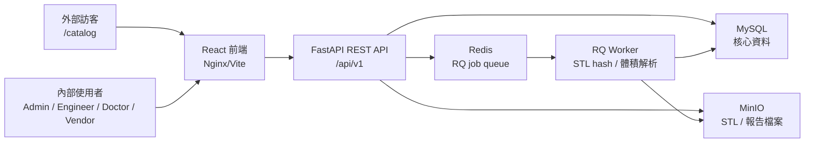
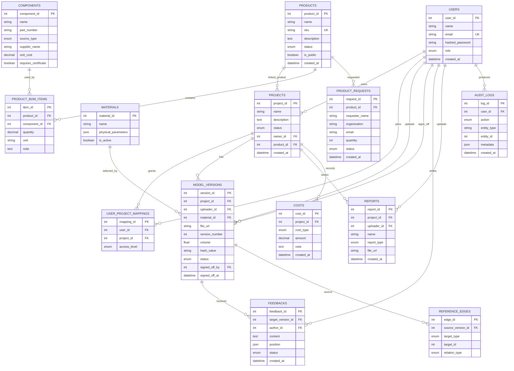
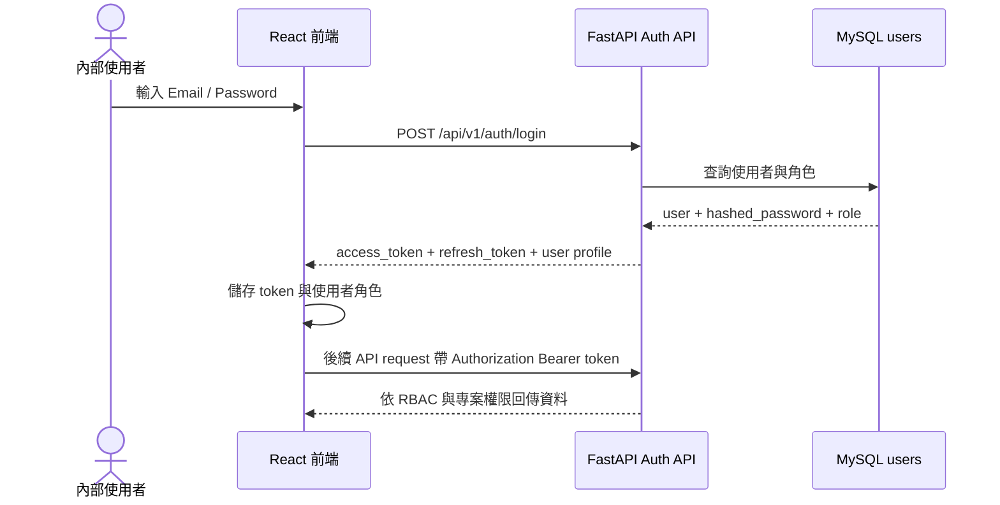
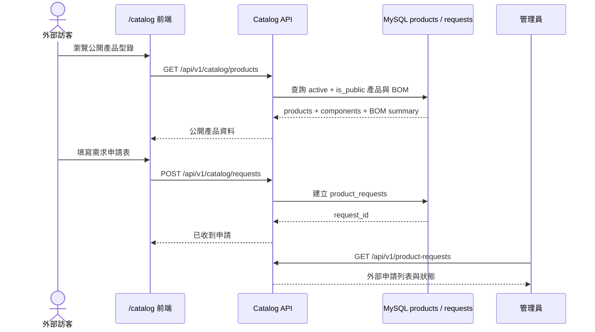
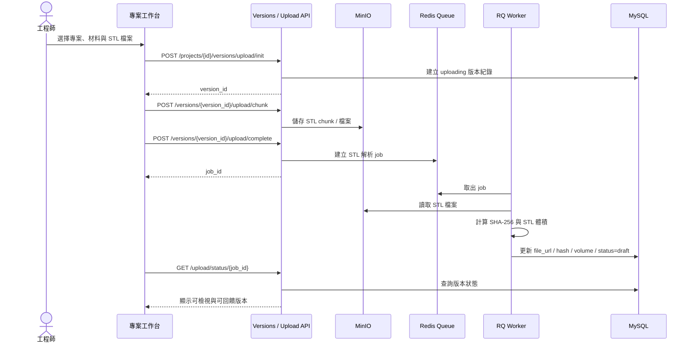

# 輕量級醫材協作平台規格書

## 1. 目標

平台用來取代 LINE 傳遞重要醫材檔案，並把「專案追溯」與「產品套組管理」整合在同一個系統中。

- STL 模型版本管理、版本溯源與 3D 回饋。
- 材料參數、報告、成本、簽核與稽核集中管理。
- 產品型錄、組件資料、產品 BOM 與外部需求申請。
- 專案可連結產品套組，讓同一個專案同時呈現 STL 材料成本與實際交付零件。
- 角色權限、專案權限與帳號開通流程彼此分離。

Linebot 不在目前範圍；外部需求先由 `/catalog` 表單收件，內部再審核、報價與開通帳號。

## 2. 技術架構

| 層級 | 技術 | 功能 |
| --- | --- | --- |
| 後端 | Python, FastAPI | REST API、JWT 驗證、RBAC、上傳流程、產品與專案業務邏輯。 |
| ORM / Migration | SQLAlchemy 2.0, Alembic | 資料庫 model 與 schema 遷移。 |
| 資料庫 | MySQL 8.0 | 使用者、專案、版本、材料、報告、成本、稽核、產品、組件、BOM、申請單。 |
| 物件儲存 | MinIO，S3/GCS 相容設計 | STL 與報告檔案。 |
| 任務佇列 | RQ + Redis | STL 合併、hash 驗證、體積解析與背景處理狀態。 |
| 前端 | React, Vite, Zustand | 單頁工作台、登入、專案管理、產品型錄與內部產品管理。 |
| 3D / 溯源 | Three.js, React Three Fiber, React Flow | STL 檢視、剖面控制、座標註記、traceability graph。 |

### 2.1 系統架構圖

## 3. 核心資料模型

所有核心資料表支援軟刪除，查詢預設只回傳 `is_deleted = false` 的資料。

### 3.0 E-R Model

本系統的資料模型以 `projects` 為內部協作核心，串接模型版本、材料、回饋、報告、成本與稽核；以 `products` 為對外產品與套組管理核心，串接組件 BOM 與外部需求申請。以下 E-R model 省略部分欄位型別，保留主鍵、重要外鍵與業務關聯。

### 3.1 使用者、專案與權限

#### Users

| 欄位 | 說明 |
| --- | --- |
| `user_id` | 使用者唯一識別碼。 |
| `name` | 使用者顯示名稱。 |
| `email` | 登入帳號，唯一。 |
| `hashed_password` | 密碼雜湊，不儲存明文。 |
| `role` | `admin`、`engineer`、`doctor`、`vendor`。 |
| `created_at` | 建立時間。 |

#### Projects

| 欄位 | 說明 |
| --- | --- |
| `project_id` | 專案唯一識別碼。 |
| `name` | 專案名稱，例如「下顎重建固定板 MR-2026-041」。 |
| `description` | 專案說明。 |
| `status` | `active` 或 `archived`。 |
| `owner_id` | 建立者。 |
| `product_id` | 可空，連到 `products.product_id`，用於顯示套組零件 BOM。 |
| `created_at` | 建立時間。 |

#### User Project Mappings

| 欄位 | 說明 |
| --- | --- |
| `mapping_id` | 專案成員權限紀錄。 |
| `user_id` | 被授權的使用者。 |
| `project_id` | 可存取的專案。 |
| `access_level` | `read_only`、`edit`、`admin`。 |

全站角色決定基本能力，專案成員 mapping 決定某使用者在某專案內是否可讀、可編輯或可管理。

### 3.2 材料與模型版本

#### Materials

| 欄位 | 說明 |
| --- | --- |
| `material_id` | 材料 ID。 |
| `name` | 材料名稱。 |
| `physical_parameters` | JSON，至少包含 `density`、`tensile_strength`、`unit_price`、`unit_price_unit`。 |
| `is_active` | 停用後不可被新版本選用。 |

#### Model Versions

| 欄位 | 說明 |
| --- | --- |
| `version_id` | 模型版本 ID。 |
| `project_id` | 所屬專案。 |
| `uploader_id` | 上傳者。 |
| `material_id` | 使用材料，必填。 |
| `file_url` | STL 檔案位置。 |
| `version_number` | 專案內版本號。 |
| `description` | 版本說明。 |
| `volume` | STL 體積，單位 mm3。 |
| `hash_value` | STL SHA-256。 |
| `status` | `uploading`、`draft`、`locked`。 |
| `signed_off_by` / `signed_off_at` | 簽核者與時間。 |
| `signoff_reason` / `signoff_user_snapshot` | 簽核理由與當下使用者快照。 |

版本只能透過 STL 上傳流程建立，不提供一般手動建立版本 API。

### 3.3 產品、組件與需求申請

#### Products

| 欄位 | 說明 |
| --- | --- |
| `product_id` | 產品 ID。 |
| `name` | 產品或套組名稱。 |
| `sku` | 型號或 SKU，唯一。 |
| `description` | 對外或內部描述。 |
| `status` | `active` 或 `archived`。 |
| `is_public` | 是否出現在公開型錄。 |

#### Components

| 欄位 | 說明 |
| --- | --- |
| `component_id` | 組件 ID。 |
| `name` | 組件名稱，例如微型固定螺釘。 |
| `part_number` | 料號，可空。 |
| `source_type` | `self_made`、`purchased`、`outsourced`、`customer_supplied`。 |
| `unit` | 單位，例如 `pcs`、`set`、`lot`。 |
| `supplier_name` | 供應商或委外廠。 |
| `unit_cost` | 組件單價。 |
| `lead_time_days` | 交期天數。 |
| `is_critical` | 是否為關鍵零件。 |
| `requires_certificate` | 是否需要文件。 |

#### Product BOM Items

| 欄位 | 說明 |
| --- | --- |
| `item_id` | BOM item ID。 |
| `product_id` | 所屬產品。 |
| `component_id` | 使用組件。 |
| `quantity` | 數量。 |
| `unit` | BOM 顯示單位。 |
| `note` | 備註，例如「外購批號需追溯」。 |
| `sort_order` | 顯示排序。 |

#### Product Requests

| 欄位 | 說明 |
| --- | --- |
| `request_id` | 外部需求申請 ID。 |
| `product_id` | 對應公開啟用產品，可空。 |
| `requester_name` | 申請人姓名。 |
| `organization` | 單位或公司。 |
| `email` / `phone` | 聯絡方式。 |
| `quantity` | 需求數量，至少 1。 |
| `message` | 規格、交期或補充說明。 |
| `status` | `submitted`、`reviewing`、`quoted`、`approved`、`rejected`。 |

公開申請只可針對 `active` 且 `is_public = true` 的產品。是否開通內部帳號，由管理員後續人工審核決定。

### 3.4 回饋、報告、成本與稽核

| 模型 | 用途 |
| --- | --- |
| `Feedbacks` | 醫師或授權使用者對特定版本留下文字與 3D 座標回饋。 |
| `Reports` | 專案文件，例如材料測試、檢驗報告、合規文件、滅菌文件。 |
| `Reference Edges` | 將版本、前一版、回饋與報告串成 traceability graph。 |
| `Costs` | 專案層級工時成本與外部打樣成本。 |
| `Audit Logs` | 建立、更新、刪除、上傳、簽核與材料變更等操作紀錄。 |

## 4. API 規格

所有需認證 API 使用 `Authorization: Bearer <access_token>`。

### 4.0 API 協作圖

API 協作通常會用 sequence diagram 呈現，重點不是列出每支 API，而是說明「使用者動作如何經過前端、後端、資料庫、物件儲存與背景任務」。本專案最重要的協作流程有三個：登入授權、外部需求申請、STL 上傳與背景解析。

#### 4.0.1 登入與授權流程

#### 4.0.2 公開型錄與外部需求申請流程

#### 4.0.3 STL 上傳、背景解析與版本追溯流程

### 4.1 公開 API

- `GET /api/v1/catalog/products`：列出公開啟用產品與公開 BOM 摘要。
- `POST /api/v1/catalog/requests`：送出外部需求申請。

### 4.2 認證 API

- `POST /api/v1/auth/login`
- `POST /api/v1/auth/refresh`
- `POST /api/v1/auth/logout`

### 4.3 產品與組件管理 API

- `GET /api/v1/products`
- `POST /api/v1/products`
- `PUT /api/v1/products/{product_id}`
- `DELETE /api/v1/products/{product_id}`
- `GET /api/v1/components`
- `POST /api/v1/components`
- `POST /api/v1/products/{product_id}/bom`
- `DELETE /api/v1/products/{product_id}/bom/{item_id}`
- `GET /api/v1/product-requests`
- `PUT /api/v1/product-requests/{request_id}`

產品、組件、BOM 編修與申請狀態更新需管理員權限；產品列表與組件列表需登入。

### 4.4 專案、成員與材料 API

- `GET /api/v1/projects/`
- `POST /api/v1/projects/`
- `GET /api/v1/projects/{project_id}`
- `GET /api/v1/projects/{project_id}/members`
- `POST /api/v1/projects/{project_id}/members`
- `DELETE /api/v1/projects/{project_id}/members/{user_id}`
- `GET /api/v1/materials/`
- `POST /api/v1/materials/`
- `PUT /api/v1/materials/{material_id}`
- `DELETE /api/v1/materials/{material_id}`

建立專案時可傳 `product_id`，用來連結產品套組 BOM。後端會確認該產品存在、啟用且未刪除。

### 4.5 模型協作 API

- `POST /api/v1/projects/{project_id}/versions/upload/init`
- `POST /api/v1/projects/{project_id}/versions/{version_id}/upload/chunk`
- `POST /api/v1/projects/{project_id}/versions/{version_id}/upload/complete`
- `GET /api/v1/projects/{project_id}/versions/{version_id}/upload/status/{job_id}`
- `GET /api/v1/projects/{project_id}/versions`
- `GET /api/v1/projects/{project_id}/versions/{version_id}`
- `POST /api/v1/projects/{project_id}/versions/{version_id}/lock`
- `GET /api/v1/projects/{project_id}/versions/{version_id}/file-url`
- `GET/POST/PUT/DELETE /api/v1/projects/{project_id}/versions/{version_id}/feedbacks`
- `GET/POST/DELETE /api/v1/projects/{project_id}/reports`
- `GET /api/v1/projects/{project_id}/reports/{report_id}/file-url`
- `POST/GET /api/v1/projects/{project_id}/versions/{version_id}/references`

### 4.6 查詢、BOM 與稽核 API

- `GET /api/v1/projects/{project_id}/bom`
- `GET /api/v1/projects/{project_id}/versions/{version_id}/bom`
- `GET /api/v1/projects/{project_id}/costs`
- `POST /api/v1/projects/{project_id}/costs`
- `GET /api/v1/projects/{project_id}/versions/{version_id}/traceability`
- `GET /api/v1/audit/logs`
- `GET /api/v1/audit/logs/export.csv`
- `GET /api/v1/audit/logs/export.pdf`
- `GET /api/v1/audit/export`

BOM 成本分兩層：

1. STL 材料成本：`volume_mm3 / 1000 = volume_cm3`，`volume_cm3 * density_g_per_cm3 = material_quantity_g`，`material_quantity_g * unit_price = material_cost`。
2. 產品套組 BOM：由 `products -> product_bom_items -> components` 顯示自製、外購、委外或客供組件，以及數量、供應商、單價與文件需求。

## 5. 前端頁面

| 路由 | 使用者目標 | 主要內容 |
| --- | --- | --- |
| `/catalog` | 外部查看產品並送出需求。 | 公開產品、組件來源、BOM 數量、需求申請表。 |
| `/login` | 內部登入。 | Email、密碼、錯誤提示。 |
| `/projects` | 管理可存取專案。 | 統計、搜尋篩選、新增專案、產品套組選擇、專案列表。 |
| `/projects/{project_id}` | 專案工作台。 | 總覽、上傳、3D 檢視、BOM、報告、成員、稽核。 |
| `/projects/{project_id}/traceability` | 檢查證據鏈。 | React Flow 溯源圖、節點資訊、版本切換。 |
| `/product-admin` | 管理產品與需求。 | 新增產品、組件、產品 BOM、外部申請狀態。 |
| `/admin/materials` | 管理材料。 | 材料列表、新增、停用。 |
| `/admin/users` | 管理使用者。 | 使用者列表、新增、刪除。 |
| `/admin/audit` | 全站稽核檢視。 | 稽核列表、篩選、CSV/PDF 匯出。 |

## 6. 權限模型

| 角色 | 權限 |
| --- | --- |
| 系統管理員 | 全站管理、產品/組件/BOM、使用者、材料、所有專案、稽核匯出。 |
| 工程師 | 需加入專案且具 `edit` 或 `admin` 才能上傳模型、報告、成本。 |
| 醫師 | 可檢視模型、建立 feedback、執行簽核。 |
| 廠商 | 依專案授權檢視資料，預設唯讀。 |
| 外部申請人 | 不需要帳號，只能使用 `/catalog` 送出需求申請。 |

## 7. 簽核與稽核原則

醫師或系統管理員可簽核 draft 版本。簽核後版本鎖定，不得覆寫該版本的 STL、材料、hash、報告與簽核紀錄。

簽核需記錄：

- 簽核理由
- 密碼二次確認
- 簽核者 ID 與使用者快照
- 簽核時間
- 不可逆 audit log

平台需能回答：

- 誰上傳了哪個模型？
- 此版本使用哪個材料？
- STL hash 是否與紀錄一致？
- 體積、材料成本與套組 BOM 如何計算？
- 哪些 feedback 和報告支持此版本？
- 哪些外購或委外組件需要文件或供應商追溯？
- 誰簽核、何時簽核、簽核理由是什麼？

## 8. Demo 與測試

`backend/reset_demo_data.py` 會重建 demo 使用者、專案、材料、版本、報告、成本、產品型錄、組件與產品 BOM。產品 seed 位於 `backend/seed_product_catalog.py`。

本地測試至少需通過：

- `docker compose exec -T backend alembic upgrade head`
- `docker compose exec -T backend python reset_demo_data.py`
- `docker compose run --rm backend python -m compileall app seed_scenario.py seed_product_catalog.py reset_demo_data.py worker.py cleanup.py cleanup_smoke_data.py`
- `docker compose run --rm backend python -m pytest -q`
- `npm run lint`
- `npm run build`
- `npm run test:e2e`
